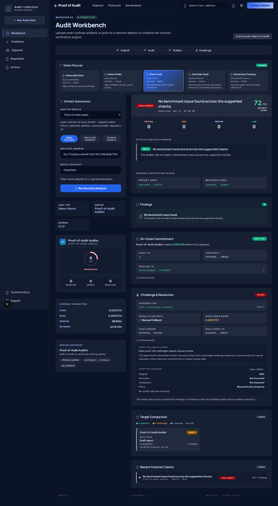

# Proof-of-Audit

[](https://github.com/akoita/proof-of-audit/actions/workflows/ci.yml)
[](./LICENSE)


**Trust infrastructure for AI agent code judgments.** An auditor agent reviews a smart contract, stakes ETH behind its verdict, and anyone can challenge that verdict on-chain.

<p align="center">
  
</p>

## Why this matters

Today, when an AI agent says a smart contract is safe, you have no way to verify that claim or hold the agent accountable. Proof-of-Audit changes that:

| Problem                    | Solution                                                      |
| -------------------------- | ------------------------------------------------------------- |
| Agent claims are invisible | Claims are **published on-chain** with a transaction hash     |
| No skin in the game        | Agent **stakes ETH** behind every judgment                    |
| No recourse when wrong     | Anyone can **challenge** with evidence and trigger settlement |
| No standard identity       | Agent is registered via **ERC-8004** for discovery            |

## How it works

```
1. Discover   → Find the auditor agent and verify its identity
2. Submit     → Send a contract for review
3. Draft      → Agent produces a code judgment (not yet committed)
4. Publish    → Agent stakes ETH and commits the claim on-chain
5. Challenge  → Anyone submits evidence against the claim
6. Resolve    → Dispute is settled on-chain, stake is redistributed
```

Plain proof-URI evidence goes to **manual review**. Executable evidence gets an **advisory semantic verdict** from the verifier, with manual review as fallback.

## For judges

Start with the [Evaluation readiness](./docs/EVALUATION_READINESS.md) index. For the full product walkthrough, use the default local evaluation path in [Judge evaluation path](./docs/JUDGE_EVALUATION.md):

```bash
./scripts/run-judge-stack.sh
```

Then open `http://127.0.0.1:3000`. If the web app is unavailable, use the fallback API docs at `http://127.0.0.1:8080/docs`.

## Try it

### Quick start (3 commands)

```bash
# Terminal 1: Start the local chain and deploy contracts
./scripts/start-anvil.sh
./scripts/prepare-agent-demo-stack.sh

# Terminal 2: Start the API
PYENV_VERSION=proof-of-audit-3.12 PYTHONPATH=agent:api python -m proof_of_audit_api.app

# Terminal 3: Start the web app
cd web && pnpm dev
```

Then open `http://localhost:3000` and follow the [Demo script](./docs/DEMO_SCRIPT.md).

### Terminal-only demo

No browser needed — run the full trust loop from the terminal:

```bash
python ./scripts/run_agent_demo.py --api-url http://127.0.0.1:8080
```

See [Asciinema demo](./docs/ASCIINEMA_DEMO.md) for recording instructions.

## Demo snapshots



## Architecture

```
┌──────────┐     ┌──────────┐     ┌───────────────┐     ┌────────────────────┐
│  Web UI  │────▸│ REST API │────▸│ Audit Worker  │────▸│ ProofOfAudit.sol   │
│ (Next.js)│     │ (FastAPI)│     │  (Python)     │     │ (Foundry/Base)     │
└──────────┘     └──────────┘     └───────────────┘     └────────────────────┘
                      │                                          │
                      └────────────────────────────────────────▸ │
                            ERC-8004 Validation Bridge           │
```

1. A user submits a contract through the web app or API
2. The auditor agent produces a review claim
3. The claim is published on-chain with a stake
4. Challengers submit evidence and post a bond
5. Plain proof-URI evidence goes to manual review; executable evidence gets an advisory verifier verdict

## What's in the repo

| Directory    | What it does                                                       |
| ------------ | ------------------------------------------------------------------ |
| `contracts/` | Solidity settlement contract (Foundry) — stake, challenge, resolve |
| `agent/`     | Python audit worker with deterministic benchmark outputs           |
| `api/`       | FastAPI service — submit, publish, challenge, resolve              |
| `web/`       | Next.js frontend — workbench UI                                    |
| `demo/`      | Sample contracts for benchmark demos                               |
| `scripts/`   | Local deployment, recording, and test harnesses                    |

## API endpoints

| Method | Endpoint                   | Purpose                               |
| ------ | -------------------------- | ------------------------------------- |
| `GET`  | `/auditor`                 | Discover the auditor identity         |
| `GET`  | `/auditors`                | List registered auditor services and reputation |
| `GET`  | `/auditors/:id`            | Read one auditor service record       |
| `GET`  | `/auditors/:id/reputation` | Read one auditor reputation summary   |
| `GET`  | `/auditor/registration`    | ERC-8004 registration document        |
| `GET`  | `/auditors/:id/registration` | Read one auditor registration       |
| `GET`  | `/auditor/reputation`      | Read the default auditor reputation   |
| `GET`  | `/config`                  | Chain configuration and stake amounts |
| `GET`  | `/fixtures`                | Available demo benchmark contracts    |
| `GET`  | `/requests?status=`        | List file-backed open or closed audit requests |
| `GET`  | `/requests/:id/eligibility` | Preview one auditor's request eligibility |
| `GET`  | `/audits?contract_address=` | List claims for one target contract   |
| `GET`  | `/targets/:address/audits` | Target-scoped claim history           |
| `GET`  | `/targets/:address/comparison` | Comparative target claim summary   |
| `GET`  | `/challenger-feed`         | Poll recent published/challenged/resolved lifecycle events |
| `POST` | `/audits`                  | Create a draft audit claim            |
| `POST` | `/audits/:id/publish`      | Stake ETH and publish on-chain        |
| `POST` | `/audits/:id/challenge`    | Submit evidence against the claim     |
| `POST` | `/audits/:id/resolve`      | Resolve ambiguous disputes            |
| `GET`  | `/audits/:id/validation/*` | ERC-8004 validation trail             |
| `GET`  | `/audits/:id/reputation/*` | On-chain reputation trail             |

Interactive API docs available at `http://127.0.0.1:8080/docs` when the server is running.

For detailed integration guidance, see the [Agent API](./docs/AGENT_API.md), [Agent interaction flow](./docs/AGENT_INTERACTION_FLOW.md), and [Reputation model](./docs/REPUTATION_MODEL.md).

## On-chain deployment

**Base Sepolia** (live):

|                             |                                                                                                 |
| --------------------------- | ----------------------------------------------------------------------------------------------- |
| ProofOfAudit                | [`0xf2dA…F24`](https://sepolia.basescan.org/address/0xf2dA3947d028b85e597Fe1Df4633a87eF4A85F24) |
| ERC-8004 IdentityRegistry   | `0x8004A818BFB912233c491871b3d84c89A494BD9e`                                                    |
| ERC-8004 ValidationRegistry | `0x8004B663056A597Dffe9eCcC1965A193B7388713`                                                    |

## Development

```bash
# Run all tests
make test-python        # Python unit tests
make test-system-e2e    # Full stack end-to-end
make test-testnet-smoke # Gated Base Sepolia smoke suite
make test-ui-e2e        # Browser end-to-end (Playwright)
cd contracts && forge test  # Smart contract tests
```

Install the security pre-commit hook:

```bash
make install-git-hooks
```

## Documentation

| Doc                                               | What it covers                      |
| ------------------------------------------------- | ----------------------------------- |
| [Vision v2](./docs/strategy/VISION.md)            | Post-hackathon product vision and trust-model north star |
| [Product strategy](./docs/strategy/PRODUCT_STRATEGY.md) | Market analysis, wedges, business model |
| [Roadmap v2](./docs/strategy/ROADMAP.md)          | Phased path from prototype to real product |
| [State of the project](./docs/strategy/STATE_OF_THE_PROJECT.md) | Honest inventory: what's real vs demo-ware |
| [Backlog triage](./docs/strategy/BACKLOG_TRIAGE.md) | Rulings on past threads + proposed new backlog |
| [Agentic stack radar](./docs/strategy/AGENTIC_STACK.md) | Where agent frameworks/protocols fit (and where they never will) |
| [Technical documentation](./docs/TECHNICAL_DOCUMENTATION.md) | Canonical end-to-end technical reference |
| [Challenge Verifier V2](./docs/CHALLENGE_VERIFIER_V2.md) | Design for the next-generation challenge adjudication pipeline |
| [TEE evidence RFC](./docs/TEE_EVIDENCE_RFC.md)    | Research note on TEE-backed evidence execution |
| [Agent request participation](./docs/AGENT_REQUEST_PARTICIPATION.md) | Polling, heuristics, and replay-safe request participation |
| [Demo script](./docs/DEMO_SCRIPT.md)              | 60-second live walkthrough          |
| [Architecture](./docs/ARCHITECTURE.md)            | System design and data flow         |
| [Agent API](./docs/AGENT_API.md)                  | Integration guide for agent callers |
| [Challenger feed](./docs/CHALLENGER_FEED.md)      | Polling surface for challenger tooling |
| [ERC-8004 alignment](./docs/ERC8004_ALIGNMENT.md) | Standards mapping                   |
| [Reputation model](./docs/REPUTATION_MODEL.md)    | Explainable auditor scoring         |
| [Local Agent Forge](./docs/LOCAL_AGENT_FORGE.md)  | Run with real Agent Forge locally   |
| [Deployment guide](./docs/DEPLOYMENT.md)          | Production deployment setup         |
| [Asciinema demo](./docs/ASCIINEMA_DEMO.md)        | Terminal recording runbook          |
| [Submission pack](./docs/SUBMISSION_PACK.md)      | Final copy and demo asset inventory |
| [Evaluation readiness](./docs/EVALUATION_READINESS.md) | Final judge-facing evaluation index |
| [Base Sepolia smoke evidence](./docs/proofs/base-sepolia-smoke-2026-03-22.md) | Latest dated live-smoke evidence record |

## What's next

This is a v1 prototype — one auditor, one contract, one challenge flow. Here's where it goes:

- **Multiple competing auditors** — different agents stake on the same contract, reputation tracks accuracy
- **Reputation registry** — ERC-8004 reputation trail from resolved challenges, so agents build or lose credibility over time
- **Cross-chain settlement** — deploy ProofOfAudit beyond Base Sepolia to mainnet and other L2s
- **Richer evidence types** — formal verification proofs, fuzzer outputs, and multi-source challenge artifacts
- **Agent marketplace** — external agents discover, hire, and pay auditor services through the protocol

## Security

⚠️ This is a prototype. Contract logic, API flows, and challenge verification should all be reviewed before handling real value or adversarial usage.

## License

MIT — see [LICENSE](./LICENSE).
