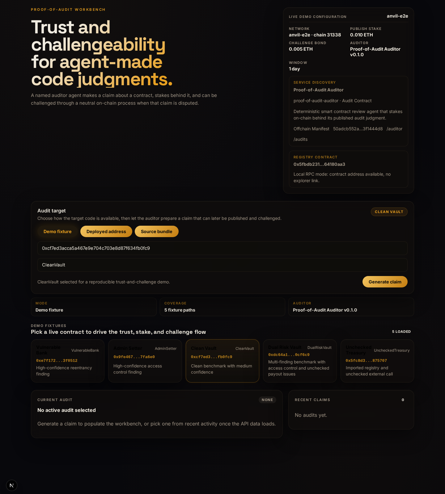
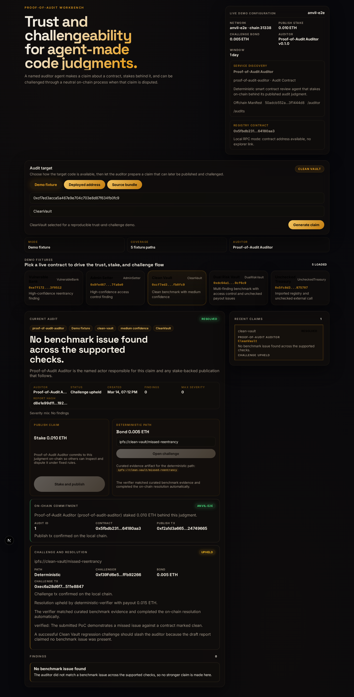

# Proof-of-Audit

[](https://github.com/akoita/proof-of-audit/actions/workflows/ci.yml)
[](./LICENSE)


Proof-of-Audit is a monorepo for agent trust and enforcement infrastructure: a named auditor agent makes a code judgment, stakes on that claim, and can be challenged through a transparent on-chain process.

For the best first pass through the repo:

1. read this page
2. follow the short runbook in [Demo script](./docs/DEMO_SCRIPT.md)
3. inspect [Architecture](./docs/ARCHITECTURE.md)
4. use [ERC-8004 alignment](./docs/ERC8004_ALIGNMENT.md) for the exact standards mapping

## Overview

Proof-of-Audit combines a deterministic audit worker, a lightweight API, a web client, and an on-chain settlement contract to demonstrate how software agents can make claims that are visible, challengeable, and economically accountable.

The current implementation focuses on:

- named agent identity and claim ownership across API, web, and on-chain publication
- a minimal discoverable auditor service record backed by a stable manifest hash
- the official ERC-8004 Base Sepolia identity path as the canonical public registration
- an ERC-8004-aligned validation bridge that mirrors published claims and resolved outcomes
- native settlement remaining in `ProofOfAudit`, with ERC-8004 used for identity, discovery, and validation interoperability
- benchmark-driven smart contract review claims
- normalized submissions for demo fixtures, deployed addresses, and source bundles
- an optional agent-forge-backed live execution lane for local repository-style inputs, with deterministic fallback preserved
- real publish transactions and challenge flows backed by stake and challenge bonds
- deterministic challenge verification for curated fixture PoCs, with manual review only for ambiguous evidence
- a browser-based trust loop for submit, publish, challenge, and explorer-linked chain state
- a compact Foundry contract with tested stake accounting

## Status

This repository is an early-stage prototype intended for rapid iteration. The current codebase is designed for local development and demos, with a clear path toward stronger chain integration, verification, and operational hardening.

Current public identity references:

- `ProofOfAudit` on Base Sepolia: `0xf2dA3947d028b85e597Fe1Df4633a87eF4A85F24`
- canonical ERC-8004 Base Sepolia `IdentityRegistry`: `0x8004A818BFB912233c491871b3d84c89A494BD9e`
- canonical ERC-8004 Base Sepolia `ValidationRegistry`: `0x8004B663056A597Dffe9eCcC1965A193B7388713`
- recorded auditor agent id: see `deployments/base-sepolia.json`

## Public alpha reviewer path

- run the local stack from the quick start below
- follow [Demo script](./docs/DEMO_SCRIPT.md) for the fastest walkthrough
- use [Architecture](./docs/ARCHITECTURE.md) for a compact system map
- use [ERC-8004 alignment](./docs/ERC8004_ALIGNMENT.md) for the exact identity and validation mapping
- use [Release notes draft](./docs/RELEASE_NOTES_DRAFT.md) for an external-facing summary

## Agent integrator path

- start with [Agent API](./docs/AGENT_API.md)
- then read [Agent interaction flow](./docs/AGENT_INTERACTION_FLOW.md)
- use `GET /auditor`, `GET /auditor/registration`, and `GET /config` before submitting requests

## Demo snapshots





## What is in this repo

- `contracts/`: Foundry contract for publishing audits, opening challenges, and resolving stake payouts.
- `agent/`: Python audit worker with deterministic outputs for benchmark contracts.
- `agent/proof_of_audit_agent/auditor_manifest.json`: ERC-8004-aligned registration document for the named auditor agent service.
- `docs/registrations/proof-of-audit-auditor.json`: stable published registration document generated from the source manifest for external discovery and later identity registration.
- `api/`: FastAPI service for submit, view, publish, and challenge flows.
- `web/`: Minimal Next.js app scaffold for the demo UI.
- `demo/`: Sample contracts that map to benchmark audit outputs.

## Current scope

This repo implements a compact, coherent v1:

- one auditor identity
- one manifest-backed auditor service profile
- one discoverable service record and discovery path
- one canonical ERC-8004 identity path on Base Sepolia, with a project-local fallback for localhost flows
- one ERC-8004-aligned validation mirror for publish and resolution outcomes
- one claim publication flow
- one on-chain stake amount
- one challenge type
- one HTTP API flow
- one frontend path

## Quick start

### Run locally

```bash
# 0. Start the local chain
cd /home/koita/dev/hackatons/proof-of-audit
./scripts/start-anvil.sh

# 1. Deploy the ProofOfAudit contract to Anvil and sync local app config
./scripts/deploy-local.sh

# 2. Deploy the local demo fixtures and write the fixture manifest
./scripts/deploy-demo-fixtures.sh

# 3. Start the API (loads api/.env.local automatically)
PYENV_VERSION=proof-of-audit-3.12 PYTHONPATH=agent:api python -m proof_of_audit_api.app

# 4. Start the frontend in a separate terminal (loads web/.env.local automatically)
cd /home/koita/dev/hackatons/proof-of-audit/web
pnpm dev
```

Note: `./scripts/deploy-local.sh` deploys only the `ProofOfAudit` smart contract to the local Anvil chain, then writes ignored local config for dependent components:

- `deployments/localhost.json`
- `api/.env.local`
- `web/.env.local`

If the current localhost manifest still points to a valid `ProofOfAudit` deployment on the same RPC, chain, network, and contract config, rerunning `./scripts/deploy-local.sh` now reuses that deployment and refreshes the generated config instead of creating a new address. Use `LOCAL_DEPLOYMENT_FORCE_REDEPLOY=1 ./scripts/deploy-local.sh` when you intentionally want a fresh local contract.

For localhost only, the generated `api/.env.local` also includes the Anvil publisher and arbiter keys so `POST /audits/:id/publish`, `POST /audits/:id/challenge`, and deterministic auto-resolution can submit real local transactions without extra manual exports.

It does not start Anvil, the API, or the frontend, and it does not deploy backend or web services anywhere.

Note: `./scripts/deploy-demo-fixtures.sh` deploys the local benchmark contracts to Anvil, writes `deployments/demo-fixtures.localhost.json`, and updates `api/.env.local` so the API can expose those live fixture addresses and suggested challenge PoC URIs to the web app.

### Contracts

```bash
cd /home/koita/dev/hackatons/proof-of-audit/contracts
forge test
```

### Python tests

```bash
cd /home/koita/dev/hackatons/proof-of-audit
python3 -m pip install setuptools wheel
python3 -m pip install --no-build-isolation -e '.[dev]'
make test-python
```

The Python suite runs with `pytest`, configured via `pyproject.toml`.

### Install the local security audit hook

```bash
cd /home/koita/dev/hackatons/proof-of-audit
make install-git-hooks
```

This installs a repository-local `pre-commit` hook that inspects staged files and only runs extra security checks when Solidity or security-sensitive backend paths changed. The hook writes `.tmp/security-audit/pre-commit-report.md` and uses a small trusted-source policy informed by OpenZeppelin Skills, Pashov Skills, and Trail of Bits Curated Skills. The full trigger map is in [Security audit workflow](./docs/SECURITY_AUDIT_WORKFLOW.md).

### Run the API

```bash
cd /home/koita/dev/hackatons/proof-of-audit
python3 -m pip install setuptools wheel
python3 -m pip install --no-build-isolation -e '.[dev]'
PYTHONPATH=agent:api python3 -m proof_of_audit_api.app
```

Server defaults:

- `http://127.0.0.1:8080`
- audit records persisted in SQLite by default under `api/data/audits.sqlite3`
- set `PROOF_OF_AUDIT_STORE_KIND=json` to opt back into file-per-record JSON storage
- interactive API docs at `http://127.0.0.1:8080/docs`

### Run the web app

```bash
cd /home/koita/dev/hackatons/proof-of-audit/web
pnpm install
NEXT_PUBLIC_PROOF_OF_AUDIT_API_URL=http://127.0.0.1:8080 pnpm dev
```

Web defaults:

- `http://127.0.0.1:3000`
- expects the API server to already be running

### Run system end-to-end tests

```bash
cd /home/koita/dev/hackatons/proof-of-audit
make test-system-e2e
```

The system e2e harness starts a dedicated Anvil instance, deploys the local contract and demo fixtures, runs the real API on an isolated port, and drives the submit, publish, challenge, and resolve lifecycle over HTTP.

### Run UI end-to-end tests

```bash
cd /home/koita/dev/hackatons/proof-of-audit/web
pnpm install
pnpm exec playwright install --with-deps chromium

cd /home/koita/dev/hackatons/proof-of-audit
make test-ui-e2e
```

The UI e2e harness starts a dedicated Anvil instance, deploys the local contract and demo fixtures, runs the API and Next.js app on isolated ports, and validates the browser flow against the real stack.

## API shape

- `GET /health`
- `GET /config`
  - includes the live auditor service profile used by the API and web workbench
- `GET /auditor`
  - returns the discoverable auditor service record, manifest hash, canonical registration URI, optional on-chain agent id, identity source, and API paths
- `GET /auditor/registration`
  - returns the ERC-8004-aligned auditor registration document with service endpoints and trust model metadata
- `GET /fixtures`
- `GET /audits`
  - returns audit records with the attached auditor agent profile from draft through resolution
- `POST /audits`
- `GET /audits/:id`
- `GET /audits/:id/validation/request`
- `GET /audits/:id/validation/response`
- `POST /audits/:id/publish`
- `POST /audits/:id/challenge`
- `POST /audits/:id/resolve`

### Example create audit request

```json
{
  "input_kind": "demo_fixture",
  "fixture_id": "vulnerable-bank",
  "submitted_by": "judge-demo"
}
```

Additional supported submission shapes:

```json
{
  "input_kind": "deployed_address",
  "chain_id": 84532,
  "contract_address": "0x1000000000000000000000000000000000000001",
  "entry_contract": "Vault",
  "submitted_by": "judge-demo"
}
```

```json
{
  "input_kind": "source_bundle",
  "source_bundle_uri": "ipfs://uploads/dual-risk-vault.zip",
  "source_bundle_label": "Dual Risk Vault upload",
  "entry_contract": "DualRiskVault",
  "submitted_by": "judge-demo"
}
```

```json
{
  "input_kind": "repository_url",
  "repository_url": "file:///home/koita/dev/example-vault",
  "entry_contract": "Vault",
  "submitted_by": "judge-demo"
}
```

When `PROOF_OF_AUDIT_WORKER_RUNTIME_MODE` is set to `hybrid` or `agent_forge`, repository submissions can use a local checkout path or `file://` URL to run a live agent-forge audit pass. The worker copies the repository into an isolated workspace, asks agent-forge to write a structured JSON report, and stores execution artifacts alongside the returned audit record. If live execution is unavailable in `hybrid` mode, the worker falls back safely.

## Demo benchmarks

- `0x1000000000000000000000000000000000000001`: reentrancy bug
- `0x1000000000000000000000000000000000000002`: missing access control
- `0x1000000000000000000000000000000000000003`: clean contract
- `0x1000000000000000000000000000000000000004`: multi-finding vault with access control and unchecked payout issues

Unknown contracts return a low-confidence informational report instead of fabricated vulnerabilities.

## Architecture

1. A user submits a demo fixture, deployed address, source bundle, or repository path through the web app or API.
2. The auditor agent either maps the normalized submission to a deterministic benchmark claim or runs an optional agent-forge-backed live pass for supported local repository inputs.
3. The API persists the claim and prepares on-chain publication metadata when the target is deployable.
4. The contract records the staked attestation and challenge lifecycle.
5. A challenger can submit a curated PoC artifact, the deterministic verifier evaluates it, and the contract resolves stake payouts under fixed rules.

For the default demo path, curated fixture evidence resolves automatically on-chain. Human arbitration stays as fallback governance for evidence the verifier cannot confirm.

### Demo challenge artifacts

- `ipfs://reentrancy-bank/withdraw-drain`: confirms the reported reentrancy finding and should reject the challenge
- `ipfs://admin-setter/unauthorized-admin-change`: confirms the reported access control finding and should reject the challenge
- `ipfs://unchecked-treasury/unchecked-call-failure`: confirms the reported unchecked call finding and should reject the challenge
- `ipfs://clean-vault/missed-reentrancy`: demonstrates a missed issue against the clean benchmark and should uphold the challenge

## Strategy notes

- [Strategic alignment](./docs/STRATEGIC_ALIGNMENT.md)
- [ERC-8004 registration alignment](./docs/ERC8004_REGISTRATION.md)
- [Agent API](./docs/AGENT_API.md)
- [Agent interaction flow](./docs/AGENT_INTERACTION_FLOW.md)
- [Demo narrative](./docs/DEMO_NARRATIVE.md)
- [Demo script](./docs/DEMO_SCRIPT.md)
- [Architecture](./docs/ARCHITECTURE.md)
- [Release notes draft](./docs/RELEASE_NOTES_DRAFT.md)
- [Submission UX](./docs/SUBMISSION_UX.md)
- [Deployment guide](./docs/DEPLOYMENT.md)
- [Demo assets](./docs/assets/README.md)

## Development

Core commands:

```bash
cd /home/koita/dev/hackatons/proof-of-audit
python3 -m pip install setuptools wheel
python3 -m pip install --no-build-isolation -e '.[dev]'
make test-python
make test-system-e2e
make test-ui-e2e
make test-e2e
cd contracts && forge test
cd ../web && pnpm build
```

See the project roadmap in `docs/ROADMAP.md`.
See deployment setup in `docs/DEPLOYMENT.md`.
See submission UX guidance in `docs/SUBMISSION_UX.md`.

## Deployment status

Base Sepolia deployment settings and manifest scaffolding are included in this repository.

- manifest: `deployments/base-sepolia.json`
- deploy script: `scripts/deploy-base-sepolia.sh`
- Foundry deployment script: `contracts/script/DeployProofOfAudit.s.sol`

Current Base Sepolia deployment:

- contract: `0xf2dA3947d028b85e597Fe1Df4633a87eF4A85F24`
- deploy tx: `0xf3896f7904443a84cedc45f64cf7259be2133c6c4d84d9a21a41e6f4321e6f41`
- explorer: `https://sepolia.basescan.org/address/0xf2dA3947d028b85e597Fe1Df4633a87eF4A85F24`

Repeatable release commands:

```bash
cd /home/koita/dev/hackatons/proof-of-audit
make deploy-base-sepolia
make verify-base-sepolia
```

## Notes

- The contract path is runnable and tested in this environment.
- The Python agent and API install from the root `pyproject.toml`.
- The web app uses a direct browser connection to the Python API, so the API exposes permissive local-demo CORS headers.

## Security

This project is a prototype and should not be treated as production-ready smart contract infrastructure. Contract logic, API flows, and challenge verification should all be reviewed before handling real value or adversarial usage.

## License

This project is licensed under the MIT License. See `LICENSE`.
