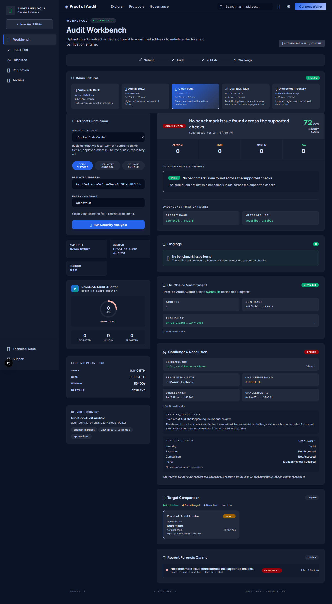

# Proof-of-Audit

[](https://github.com/akoita/proof-of-audit/actions/workflows/ci.yml)
[](./LICENSE)


Proof-of-Audit is a prototype for publishing stake-backed smart-contract security
claims and challenging them with evidence. It connects an auditor's report,
source provenance, on-chain escrow, and a reviewable dispute outcome.

## Status and trust boundary

The local stack supports draft → publish → challenge → resolve. The API submits
transactions; the operator-held arbiter key decides disputes. Executable evidence
verification is **advisory**, and a report hash establishes provenance rather
than correctness. A bonded claim is not a guarantee that a contract is safe.

The default `deterministic` demo returns prewritten fixture reports. Live
execution requires a configured backend; see [Local Agent Forge](./docs/LOCAL_AGENT_FORGE.md).
Persona demos are not independent audit engines.

The current contract was deployed to Base Sepolia on 8 October 2026 at
[`0x10eb28034c2b8f77400c3c2eaa1984b019655ae6`](https://sepolia.basescan.org/address/0x10eb28034c2b8f77400c3c2eaa1984b019655ae6).
Its creation and runtime bytecode match source commit `c7c2544`, including the
eight constructor parameters and request/fee features. **BaseScan source
verification is complete**; a recorded live settlement cycle is still
outstanding. See the [deployment record and recovery steps](./docs/DEPLOYMENT.md#current-status).

## Try the local fixture workflow

Install Python 3.12+, Foundry, Node.js, and pnpm, then follow
[development setup](./CONTRIBUTING.md#development-setup) to install dependencies.
Commands below run from the repository root unless they change directory.

Start Anvil in the first terminal:

```bash
./scripts/start-anvil.sh
```

Prepare local contracts, fixtures, and identity configuration in a second terminal:

```bash
export PYENV_VERSION=proof-of-audit-3.12
export PYTHONPATH=agent:api
PYTHON_BIN="$(pyenv which python)" ./scripts/prepare-agent-demo-stack.sh
```

Start the API after preparation completes:

```bash
PYENV_VERSION=proof-of-audit-3.12 PYTHONPATH=agent:api \
  python -m proof_of_audit_api.app
```

Start the frontend in another terminal:

```bash
cd web
pnpm dev
```

Open [the local workbench](http://127.0.0.1:3000) and follow the
[fixture walkthrough](./docs/DEMO_SCRIPT.md). Local defaults are API `8080`,
Anvil `8545`, Agent Forge `8000`, and frontend `3000`; configuration overrides
are documented in [the deployment guide](./docs/DEPLOYMENT.md).

For a terminal-only walkthrough against the running API:

```bash
PYENV_VERSION=proof-of-audit-3.12 PYTHONPATH=agent:api \
  python scripts/run_agent_demo.py --api-url http://127.0.0.1:8080
```



## System and interfaces

The Next.js workbench calls a FastAPI service. The service coordinates the audit
worker, stores reports and evidence, and uses separate configured clients for
publication and arbitration. `ProofOfAudit` enforces escrow, timing, and payout
rules implemented by the selected deployment. Identity and validation bridges
are integrations, not the settlement authority.

Read the [architecture overview](./docs/architecture/overview.md) for component
boundaries and persistence limitations. For integrations, use the
[Agent API guide](./docs/AGENT_API.md) and the running service's
[OpenAPI documentation](http://127.0.0.1:8080/docs); the API schemas are defined
in [schemas.py](./api/proof_of_audit_api/schemas.py).

## Verify and contribute

The [contributor guide](./CONTRIBUTING.md) covers dependency installation, Python
and contract tests, browser/system checks, and the security hook. Live testnet
checks require configured infrastructure and signing roles; a skipped run is
not live settlement evidence. [Formal testing](./docs/FORMAL_TESTING.md) documents
separate Halmos checks and their scope.

External contributions remain paused under the contributor policy. Changes go
through feature branches and pull requests; merging requires maintainer approval.

## Documentation and planned work

Start at the [documentation map](./docs/README.md) for guides, operations,
reference material, proposals, and historical records. The
[strategy roadmap](./docs/strategy/ROADMAP.md) governs delivery: Phase 0 truth
and hygiene remains the current gate. Later work is planned, not a description
of released capabilities.

This prototype needs independent review before handling meaningful funds or
adversarial use. Licensed under [MIT](./LICENSE).
