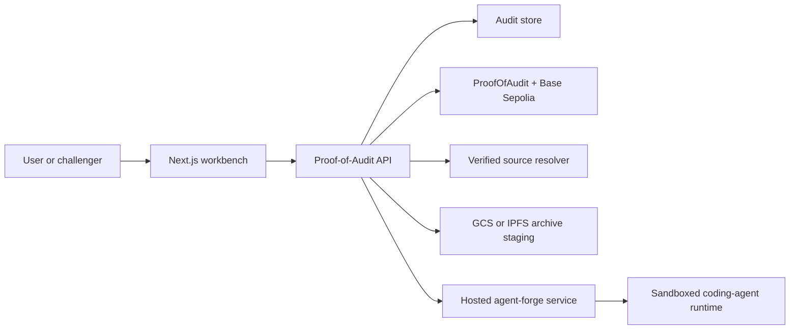

# External Agent-Forge Operations

This runbook explains how Proof-of-Audit operates when live source-based audits
are delegated to a separately deployed `agent-forge` service.

It is the operator-facing companion to:

- [Agent-Forge service contract](./AGENT_FORGE_SERVICE_CONTRACT.md)
- [External Agent-Forge integration](./AGENT_FORGE_SERVICE_INTEGRATION.md)
- [Architecture](./ARCHITECTURE.md)

## Why this architecture matters

Proof-of-Audit used to treat live coding-agent execution as an implementation
detail of the API container. The external-service architecture turns that hidden
runtime into an explicit system boundary:

- Proof-of-Audit stays responsible for user-facing submission policy, storage,
  publication, challenge, and settlement.
- `agent-forge` becomes a reusable execution service with a stable machine
  contract instead of a local subprocess convention.
- operators can scale, harden, and observe the coding-agent runtime separately
  from the API.

This is a meaningful milestone because it proves the product is not just "an API
that shells out to a local tool." It becomes an orchestrator around a distinct
audit-execution service.

## System model



## Trust boundaries

### Proof-of-Audit API

Trusted to:

- validate accepted submission kinds
- resolve verified source for `deployed_address` targets
- decide whether deterministic fallback is allowed
- persist audit records and remote execution metadata
- publish and challenge on-chain claims

Not trusted to:

- run a privileged Docker-capable coding-agent sandbox inside the API process

### Staging storage

Trusted to:

- hold prepared source archives long enough for the hosted service to read them
- preserve integrity through stable object URIs and source digests

Not trusted to:

- make audit-policy decisions

### Hosted `agent-forge` service

Trusted to:

- authenticate the calling client
- run the coding-agent runtime in a sandbox
- emit machine-readable run status, report, and log artifacts

Not trusted to:

- resolve verified source from chain-specific explorers on behalf of
  Proof-of-Audit
- decide whether a failed live run may fall back to deterministic behavior

## Operating model

### Submission path

For a live `deployed_address` audit on a non-local network:

1. the API validates the request
2. the API resolves verified source from Sourcify or explorer APIs
3. the API creates a zip archive and computes a `sha256:` source digest
4. the API uploads the archive to remotely readable storage
5. the API submits the run to hosted `agent-forge`
6. the API polls until the remote run reaches `completed`, `failed`, or
   `cancelled`
7. the API stores the machine-readable report plus remote execution metadata

### Failure policy

The critical rule is narrow and intentional:

- non-local `deployed_address` submissions must not silently fall back to a
  deterministic benchmark report when the hosted path fails

That means operators should expect request failure, not a "clean" audit record,
when any of these fail:

- verified source resolution
- source archive staging upload
- remote run submission
- remote run completion
- remote report retrieval

## Required infrastructure

Minimum useful deployment shape:

- Proof-of-Audit API service
- hosted `agent-forge` service
- remotely readable source-archive staging backend
  - GCS is the simplest production default in this repo
  - IPFS is supported when an authenticated upload API is available
- durable audit store
- chain RPC and explorer API access

Recommended production controls:

- authenticated service-to-service calls from the API to `agent-forge`
- a dedicated staging bucket or prefix for uploaded source archives
- lifecycle expiration for staged archives
- concurrency and quota controls on the hosted service
- durable log retention for remote run artifacts

## Configuration checklist

The API-side hosted-service path is enabled with:

```dotenv
PROOF_OF_AUDIT_WORKER_RUNTIME_MODE=hybrid
PROOF_OF_AUDIT_AGENT_FORGE_SERVICE_URL=https://agent-forge.example
PROOF_OF_AUDIT_AGENT_FORGE_SERVICE_TOKEN=
PROOF_OF_AUDIT_AGENT_FORGE_SERVICE_PROFILE_ID=proof-of-audit-solidity-v1
PROOF_OF_AUDIT_AGENT_FORGE_SERVICE_REPORT_SCHEMA=proof-of-audit-report-v1
PROOF_OF_AUDIT_AGENT_FORGE_SERVICE_POLL_INTERVAL_SECONDS=0.25
PROOF_OF_AUDIT_AGENT_FORGE_SERVICE_POLL_TIMEOUT_SECONDS=60
PROOF_OF_AUDIT_AGENT_FORGE_SERVICE_REQUEST_TIMEOUT_SECONDS=30
PROOF_OF_AUDIT_SOURCE_BUNDLE_STORAGE_KIND=gcs
PROOF_OF_AUDIT_SOURCE_BUNDLE_GCS_BUCKET=proof-of-audit-source-bundles
PROOF_OF_AUDIT_SOURCE_BUNDLE_GCS_PREFIX=agent-forge
```

Important operational detail:

- `PROOF_OF_AUDIT_SOURCE_BUNDLE_STORAGE_KIND=local` is valid for manual source
  uploads, but it is not valid for the hosted `agent-forge` path unless the API
  and service intentionally share that filesystem

## Local development workflow

This workflow is for reproducing the architecture without deploying to a public
environment.

### Option A: local API + local hosted service + shared storage

Use this when both processes run on the same workstation and you want the
fastest loop.

1. start the local chain and API prerequisites

```bash
cd /home/koita/dev/hackatons/proof-of-audit
./scripts/start-anvil.sh
./scripts/deploy-local.sh
./scripts/deploy-demo-fixtures.sh
```

2. run the hosted `agent-forge` service separately

- use the service repo's local dev instructions
- point it at a sandbox-compatible runtime and a known local port

3. run Proof-of-Audit against that service

```bash
cd /home/koita/dev/hackatons/proof-of-audit
export PROOF_OF_AUDIT_WORKER_RUNTIME_MODE=hybrid
export PROOF_OF_AUDIT_AGENT_FORGE_SERVICE_URL=http://127.0.0.1:8090
export PROOF_OF_AUDIT_SOURCE_BUNDLE_STORAGE_KIND=local
PYENV_VERSION=proof-of-audit-3.12 PYTHONPATH=agent:api python -m proof_of_audit_api.app
```

Only use `local` staging here when both sides deliberately share the same
filesystem or you are testing with repository-local paths that the service can
read directly.

### Option B: local API + staging hosted service

Use this when the API is local but the hosted service runs remotely.

1. configure the API to use a remote staging backend

```bash
export PROOF_OF_AUDIT_WORKER_RUNTIME_MODE=hybrid
export PROOF_OF_AUDIT_AGENT_FORGE_SERVICE_URL=https://agent-forge-staging.example
export PROOF_OF_AUDIT_AGENT_FORGE_SERVICE_TOKEN=...
export PROOF_OF_AUDIT_SOURCE_BUNDLE_STORAGE_KIND=gcs
export PROOF_OF_AUDIT_SOURCE_BUNDLE_GCS_BUCKET=proof-of-audit-staging-source-bundles
export PROOF_OF_AUDIT_SOURCE_BUNDLE_GCS_PREFIX=agent-forge
```

2. start the API

```bash
cd /home/koita/dev/hackatons/proof-of-audit
PYENV_VERSION=proof-of-audit-3.12 PYTHONPATH=agent:api python -m proof_of_audit_api.app
```

3. submit a real `deployed_address` audit or repository-backed submission

Recommended staging validation:

- a known Base Sepolia target with verified source
- one negative case where the hosted run is expected to fail
- confirmation that the resulting audit record stores `execution.source` as
  `agent_forge_service`

## Debugging workflow

When the hosted path fails, debug in this order:

1. confirm the submission is actually targeting the hosted path
   - `execution.backend` should be `agent_forge`
   - `execution.source` should be `agent_forge_service`
2. confirm source staging succeeded
   - check `source_digest`
   - verify the staged object URI exists and is readable by the service
3. confirm the hosted service accepted the run
   - inspect `run_id`
   - inspect `status_url`
4. inspect remote artifacts
   - fetch the machine-readable report from `report_path`
   - inspect `logs_url`
5. confirm failure policy
   - non-local `deployed_address` audits should fail rather than degrade into a
     deterministic benchmark result

Common failure classes:

- explorer or Sourcify source resolution failure
- storage misconfiguration
- API can upload but hosted service cannot read the staged archive
- remote sandbox startup failure
- hosted service returns a non-terminal success state until the API poll timeout
- hosted report is missing or invalid

## Rollout plan

Recommended rollout order:

1. prove the contract and payload shape in docs and tests
2. run Proof-of-Audit locally against a local hosted service
3. stand up a staging hosted service with authenticated access
4. switch the API staging environment to the hosted-service path with remote
   archive staging
5. add repeatable smoke coverage against the deployed path
6. promote the hosted path to the primary non-local live-audit mode

## Evidence that the architecture is in use

When the externalized architecture is working, operators should be able to point
to all of the following:

- the API is configured with `PROOF_OF_AUDIT_AGENT_FORGE_SERVICE_URL`
- source archives are staged to remote storage rather than passed as local
  filesystem URIs
- audit records store remote execution metadata such as `run_id`,
  `status_url`, `logs_url`, `source_digest`, and `profile_id`
- failed non-local live runs do not silently fall back to a deterministic clean
  result
