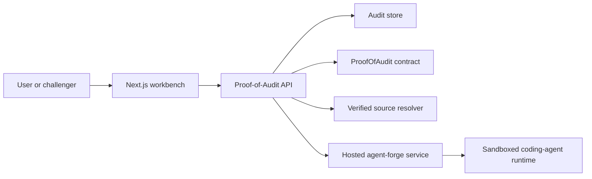

# External Agent-Forge Integration

This document describes how Proof-of-Audit should consume a separately deployed
`agent-forge` service.

It is the integration-side companion to:

- [Agent-Forge service contract](./AGENT_FORGE_SERVICE_CONTRACT.md)
- [Pluggable auditor integration](./PLUGGABLE_AUDITOR_INTEGRATION.md)

## Architecture decision

Proof-of-Audit should stop hosting the live coding-agent runtime inside the API
container.

Target shape:

Why this is the right split:

- the API should orchestrate, not host a Docker-capable agent runtime
- `agent-forge` should become a reusable service instead of a hidden internal subprocess
- Proof-of-Audit stays focused on audit records, settlement, and chain-specific policy

## Integration rules

### 1. Proof-of-Audit owns submission validation

Proof-of-Audit remains the source of truth for:

- accepted user submission modes
- chain id and target contract validation
- whether a submission is publishable
- whether deterministic fallback is forbidden

### 2. Proof-of-Audit owns deployed-address source resolution

For `deployed_address` submissions:

- Proof-of-Audit resolves verified source first
- Proof-of-Audit packages the resolved source as an archive or repository snapshot
- Proof-of-Audit submits that prepared source to `agent-forge`

This keeps `agent-forge` generic and avoids coupling it to one explorer stack.

### 3. Agent-forge owns live execution

The hosted service owns:

- sandbox startup
- coding-agent execution
- machine-readable report generation
- run logs and execution artifacts

### 4. No deterministic fallback for non-local deployed-address audits

If the external `agent-forge` path fails for a non-local deployed-address audit:

- the audit request fails
- Proof-of-Audit must not silently substitute benchmark or deterministic findings

This rule should remain in place after the external service migration.

## API-side flow

For a non-local `deployed_address` submission:

1. validate the request
2. resolve verified source from Sourcify or explorer APIs
3. materialize a source bundle and compute a source digest
4. submit a run request to hosted `agent-forge`
5. store remote run metadata on the audit record
6. poll run status until completion or failure
7. ingest the report into the Proof-of-Audit audit record
8. allow publish only after a completed report is attached

## Audit record mapping

Proof-of-Audit should map hosted run state into `execution` metadata, not into the
top-level audit status directly.

Suggested mapping:

- remote `accepted` or `queued`
  - audit `status: "draft"`
  - `execution.status: "queued"`
- remote `running`
  - audit `status: "draft"`
  - `execution.status: "running"`
- remote `completed`
  - audit `status: "draft"`
  - `execution.status: "completed"`
- remote `failed`
  - request fails before durable draft creation, or the draft records `execution.status: "failed"` with no publish path

The important rule is that a failed remote run must not be normalized into a clean
report.

## Transport choices

Recommended first cut:

- Proof-of-Audit submits jobs over authenticated HTTP
- Proof-of-Audit polls for status
- report retrieval happens through a separate report endpoint
- prepared source archives should be uploaded to remotely readable storage such as GCS or IPFS before submission
- local filesystem paths are not a valid hosted-service source transport unless both systems explicitly share that volume

This is slower than an in-process subprocess, but much simpler than introducing
webhooks, event buses, or queue consumers immediately.

## Security and operations

The integration should assume:

- service-to-service authentication
- explicit client authorization
- concurrency controls on the hosted `agent-forge` service
- durable report and log artifacts
- run-level correlation ids between Proof-of-Audit and `agent-forge`

Minimum useful metadata to persist on the Proof-of-Audit audit record:

- external run id
- external status url
- external report url
- source digest
- selected profile id
- terminal error code and message, if any

## Migration plan

Recommended order:

1. define and freeze the HTTP contract
2. add headless report-writer mode in `agent-forge`
3. deploy hosted `agent-forge`
4. add authentication and policy controls
5. replace API-local live execution with remote calls
6. add smoke coverage against the hosted path

The API-local live shim should be treated as transitional once the hosted service
is stable.
