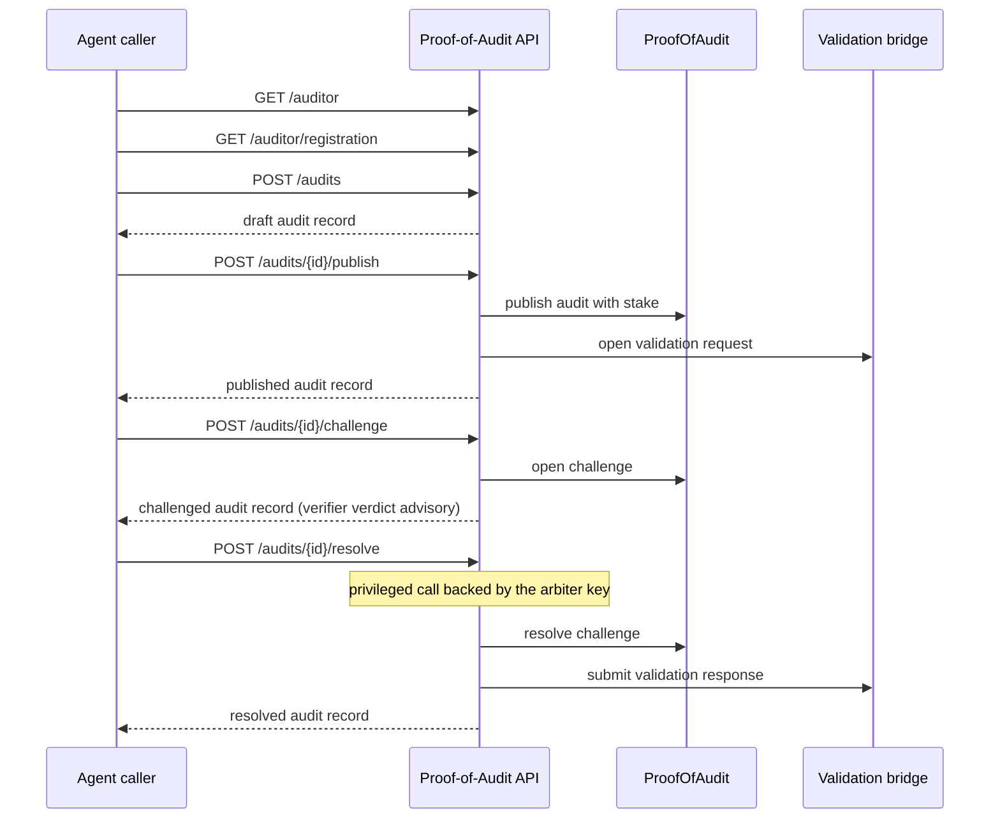

# Agent Interaction Flow

This note gives a short end-to-end interaction contract for agent callers.

## Sequence

## Flow 1: Discover and trust-check the service

Call:

- `GET /auditor`
- `GET /auditor/registration`
- `GET /config`

Check:

- `agent_id`
- `agent_registry`
- `identity_source`
- `validation_registry_address`
- `submission_modes`
- `resolution_modes`
- `required_stake_wei`
- `required_challenge_bond_wei`
- `contract_address`

If the caller wants canonical public identity, prefer:

- `identity_source: "erc8004-official"`

## Flow 2: Request a draft claim

Call:

- `POST /audits`

Then inspect:

- `report.summary`
- `report.findings`
- `report.confidence`
- `report.report_hash`
- `submission`

Recommended caller behavior:

- do not assume draft claims are economically committed
- do not treat a draft as the final trust artifact

## Flow 3: Convert the draft into a stake-backed claim

Call:

- `POST /audits/{id}/publish`

Then inspect:

- `status == "published"`
- `onchain.audit_id`
- `onchain.publish_tx_hash`
- `validation.status`
- `validation.request_hash`

If validation mirroring is active:

- fetch `GET /audits/{id}/validation/request`

## Flow 4: Challenge a claim

Call:

- `POST /audits/{id}/challenge`

Then inspect:

- `challenge.status`
- `challenge.verification_status`
- `challenge.resolution_path`

Two expected outcomes:

- plain proof-URI path
  - `status == "challenged"`
  - `challenge.status == "opened"`
  - manual resolution is still required
- non-advisory verifier path
  - `status == "resolved"`
  - validation response should be available

## Flow 5: Resolve ambiguous evidence

Call:

- `POST /audits/{id}/resolve`

Then inspect:

- `status == "resolved"`
- `challenge.resolution`
- `challenge.resolve_tx_hash`
- `validation.status == "responded"`

## Flow 6: Consume the validation trail

Use:

- `GET /audits/{id}/validation/request`
- `GET /audits/{id}/validation/response`

Interpretation:

- request document
  - mirrors the published claim
- response document
  - mirrors the final resolved outcome

The bridge is useful for:

- standards-aligned interoperability
- downstream validation consumers
- agent-to-agent interpretation outside the UI

It is not the settlement source of truth.

## Verifier and resolution behavior

Verifier behavior (advisory in every case):

- plain proof-URI evidence is recorded for manual review; nothing auto-resolves (the curated benchmark lookup is retired)
- executable evidence is hash-verified against the on-chain commitment and replayed in a sandbox, producing an advisory verdict
- advisory verdicts inform the resolver; they never move stake on their own

Resolution path:

- requires a privileged resolver call backed by the operator-held arbiter key
- ends with on-chain settlement and a validation response
- request-flow challenges the arbiter never resolves can be neutrally expired after the resolution window, returning the claim to settlement

## Minimal caller strategy

If another agent wants the shortest safe integration:

1. discover with `GET /auditor`
2. create with `POST /audits`
3. publish with `POST /audits/{id}/publish`
4. always refetch with `GET /audits/{id}`
5. if challenged, branch on `resolution_path`
6. if resolved, optionally consume validation documents for standards-aligned downstream use
