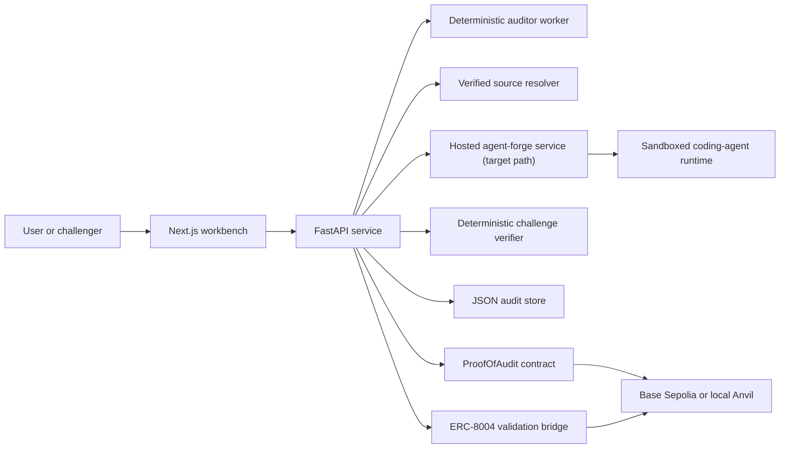

# Architecture

Proof-of-Audit is a small, opinionated stack for making agent-made code judgments visible, stake-backed, and challengeable.

The public standards story is intentionally narrow:

- the auditor uses the official ERC-8004 Base Sepolia identity path
- the service exposes an ERC-8004-aligned registration document and discovery record
- the validation trail is mirrored into ERC-8004-aligned request and response artifacts
- native settlement still happens in `ProofOfAudit`

## System shape

## Components

### Web workbench

- submission entrypoint for demo fixtures, deployed addresses, and source bundles
- surfaces the named auditor identity and service-discovery record
- makes the identity path explicit so reviewers can tell when the stack is using the official ERC-8004 registry versus a local fallback
- shows the claim lifecycle from draft to on-chain resolution

Key file:
- `/home/koita/dev/hackatons/proof-of-audit/web/app/audit-workbench.tsx`

### API service

- normalizes submissions
- persists audit records
- exposes the auditor profile and service record
- can describe multiple auditor services with explicit execution and settlement metadata
- exposes whether the current identity path is the official ERC-8004 registry or a local fallback
- emits ERC-8004-aligned validation request and response documents for published and resolved audits
- submits publish and challenge transactions
- preserves plain proof-URI challenges for manual review
- leaves ambiguous cases on the manual fallback path

Key files:
- `/home/koita/dev/hackatons/proof-of-audit/api/proof_of_audit_api/app.py`
- `/home/koita/dev/hackatons/proof-of-audit/api/proof_of_audit_api/service.py`
- `/home/koita/dev/hackatons/proof-of-audit/api/proof_of_audit_api/config.py`

### Auditor worker

- maps supported demo inputs to deterministic benchmark claims
- returns richer findings with evidence URIs and severity breakdowns
- in the target architecture, live source-based execution moves out of this process and into a separately deployed `agent-forge` service

Key files:
- `/home/koita/dev/hackatons/proof-of-audit/agent/proof_of_audit_agent/worker.py`
- `/home/koita/dev/hackatons/proof-of-audit/agent/proof_of_audit_agent/auditor_manifest.json`

### External agent-forge service

- target execution path for live source-based audits
- consumes prepared source archives or repository snapshots from Proof-of-Audit
- runs the canonical coding-agent runtime in a sandbox-compatible environment
- returns machine-readable run status and report artifacts back to the API

Design docs:

- `/home/koita/dev/hackatons/proof-of-audit/docs/AGENT_FORGE_SERVICE_CONTRACT.md`
- `/home/koita/dev/hackatons/proof-of-audit/docs/AGENT_FORGE_SERVICE_INTEGRATION.md`
- `/home/koita/dev/hackatons/proof-of-audit/docs/AGENT_FORGE_OPERATIONS.md`

### Challenge verifier

- evaluates curated proof URIs against benchmark expectations
- can only auto-resolve when a non-advisory verifier produces a concrete upheld or rejected outcome
- otherwise leaves the dispute on the manual fallback path

Key file:
- `/home/koita/dev/hackatons/proof-of-audit/agent/proof_of_audit_agent/challenge_verifier.py`

### On-chain contract

- records the published claim
- escrows the auditor stake and challenge bond
- stores challenge state
- pays out the winner after resolution

Key file:
- `/home/koita/dev/hackatons/proof-of-audit/contracts/src/ProofOfAudit.sol`

### Pluggable auditor boundary

Independent auditors are expected to integrate through a narrow boundary:

- Proof-of-Audit-compatible audit request / response shapes
- a service record that declares execution and settlement mode
- an optional staking adapter contract when publication is delegated

That adapter boundary is documented in:

- `/home/koita/dev/hackatons/proof-of-audit/docs/PLUGGABLE_AUDITOR_INTEGRATION.md`
- `/home/koita/dev/hackatons/proof-of-audit/contracts/src/interfaces/IProofOfAuditStakeAdapter.sol`

### Validation bridge

- mirrors published claims into an ERC-8004-style validation request
- mirrors resolved outcomes into an ERC-8004-style validation response
- keeps the native `ProofOfAudit` contract as the source of truth for stake, challenge, and payout logic
- uses the official Base Sepolia `ValidationRegistry` as the canonical public target, with a local adapter for self-contained test environments

Key files:
- `/home/koita/dev/hackatons/proof-of-audit/api/proof_of_audit_api/validation_bridge.py`
- `/home/koita/dev/hackatons/proof-of-audit/contracts/src/ValidationRegistryAdapter.sol`

## Trust model

The trust model is intentionally narrow:

- the auditor is explicitly named
- the claim is recorded on-chain with stake
- challengers can dispute the claim with evidence
- plain proof-URI evidence no longer auto-resolves from a curated benchmark lookup
- manual arbitration only exists for evidence the verifier cannot confirm

This means the product is strongest as trust and enforcement infrastructure for agent-made judgments, not as a general-purpose audit engine.

## ERC-8004 boundary

Proof-of-Audit should be described as ERC-8004-aligned, not as a full ERC-8004 implementation.

What ERC-8004 covers here:

- agent identity
- registration and discovery
- validation interoperability

What remains domain-specific:

- escrowed stake
- challenge opening
- resolution authority
- payouts

That division keeps the standards story honest and keeps the enforcement logic in the contract designed for it.

## Main data flows

### Claim publication

1. A user submits a fixture, deployed address, or source bundle.
2. The worker returns a deterministic review claim.
3. The API stores the claim and attaches the named auditor profile.
4. The auditor publishes the claim on-chain with stake.
5. The API mirrors that publication into the validation bridge as a standards-aligned request.

### Challenge resolution

1. A challenger submits a proof URI.
2. The contract opens the challenge and escrows the bond.
3. The verifier evaluates the proof against known benchmark cases.
4. If the case is known, the API resolves the challenge on-chain automatically.
5. If the case is ambiguous, the challenge remains open for fallback governance.
6. Once the outcome is resolved, the API mirrors the result into the validation bridge.

## External reviewer checklist

When reviewing the repo, the fastest path is:

1. `/home/koita/dev/hackatons/proof-of-audit/README.md`
2. `/home/koita/dev/hackatons/proof-of-audit/docs/DEMO_SCRIPT.md`
3. `/home/koita/dev/hackatons/proof-of-audit/docs/DEPLOYMENT.md`
4. `/home/koita/dev/hackatons/proof-of-audit/docs/DEMO_NARRATIVE.md`
