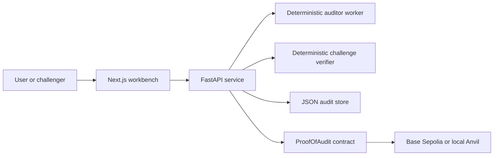

# Architecture

Proof-of-Audit is a small, opinionated stack for making agent-made code judgments visible, stake-backed, and challengeable.

## System shape

## Components

### Web workbench

- submission entrypoint for demo fixtures, deployed addresses, and source bundles
- surfaces the named auditor identity and service-discovery record
- makes the identity path explicit so reviewers can tell when the stack is using the official ERC-8004 registry versus a local fallback
- shows the claim lifecycle from draft to on-chain resolution

Key file:
- `/home/koita/dev/hackatons/proof-of-audit/web/app/audit-workbench.tsx`

### API service

- normalizes submissions
- persists audit records
- exposes the auditor profile and service record
- exposes whether the current identity path is the official ERC-8004 registry or a local fallback
- submits publish and challenge transactions
- auto-resolves curated deterministic cases
- leaves ambiguous cases on the manual fallback path

Key files:
- `/home/koita/dev/hackatons/proof-of-audit/api/proof_of_audit_api/app.py`
- `/home/koita/dev/hackatons/proof-of-audit/api/proof_of_audit_api/service.py`
- `/home/koita/dev/hackatons/proof-of-audit/api/proof_of_audit_api/config.py`

### Auditor worker

- maps supported demo inputs to deterministic benchmark claims
- returns richer findings with evidence URIs and severity breakdowns

Key files:
- `/home/koita/dev/hackatons/proof-of-audit/agent/proof_of_audit_agent/worker.py`
- `/home/koita/dev/hackatons/proof-of-audit/agent/proof_of_audit_agent/auditor_manifest.json`

### Challenge verifier

- evaluates curated proof URIs against benchmark expectations
- chooses deterministic resolution when the evidence matches a known case
- otherwise leaves the dispute on the manual fallback path

Key file:
- `/home/koita/dev/hackatons/proof-of-audit/agent/proof_of_audit_agent/challenge_verifier.py`

### On-chain contract

- records the published claim
- escrows the auditor stake and challenge bond
- stores challenge state
- pays out the winner after resolution

Key file:
- `/home/koita/dev/hackatons/proof-of-audit/contracts/src/ProofOfAudit.sol`

## Trust model

The trust model is intentionally narrow:

- the auditor is explicitly named
- the claim is recorded on-chain with stake
- challengers can dispute the claim with evidence
- deterministic verification is the default path for curated benchmark cases
- manual arbitration only exists for evidence the verifier cannot confirm

This means the product is strongest as trust and enforcement infrastructure for agent-made judgments, not as a general-purpose audit engine.

## Main data flows

### Claim publication

1. A user submits a fixture, deployed address, or source bundle.
2. The worker returns a deterministic review claim.
3. The API stores the claim and attaches the named auditor profile.
4. The auditor publishes the claim on-chain with stake.

### Challenge resolution

1. A challenger submits a proof URI.
2. The contract opens the challenge and escrows the bond.
3. The verifier evaluates the proof against known benchmark cases.
4. If the case is known, the API resolves the challenge on-chain automatically.
5. If the case is ambiguous, the challenge remains open for fallback governance.

## External reviewer checklist

When reviewing the repo, the fastest path is:

1. `/home/koita/dev/hackatons/proof-of-audit/README.md`
2. `/home/koita/dev/hackatons/proof-of-audit/docs/DEMO_SCRIPT.md`
3. `/home/koita/dev/hackatons/proof-of-audit/docs/DEPLOYMENT.md`
4. `/home/koita/dev/hackatons/proof-of-audit/docs/DEMO_NARRATIVE.md`
