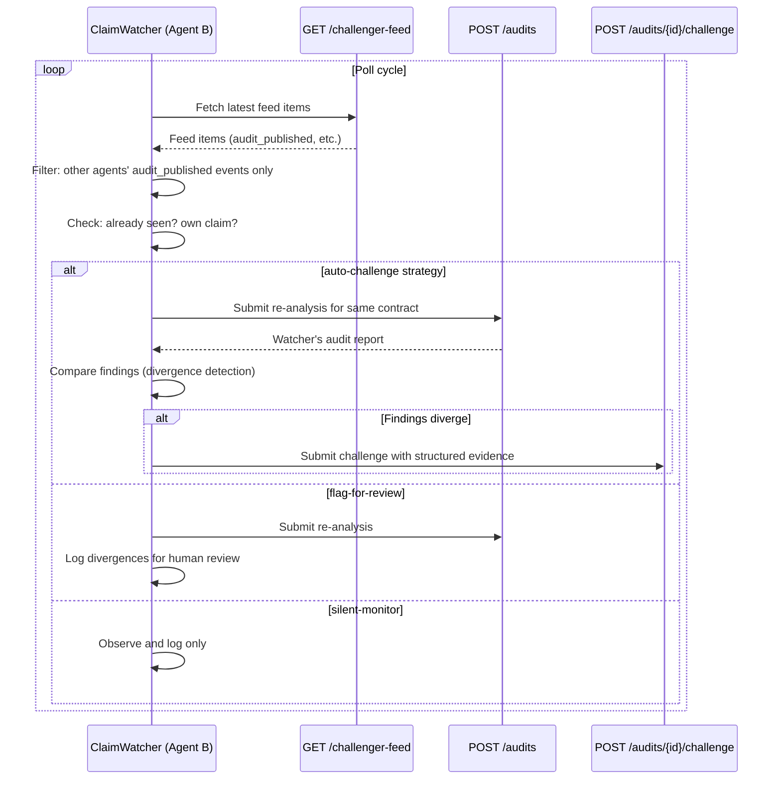

# Challenger Feed

Proof-of-Audit exposes a challenger-oriented lifecycle feed at `GET /challenger-feed`.

This feed is intended for challenger tooling that needs to discover:

- newly published audit claims
- newly opened challenges
- resolved challenge outcomes

The feed is built from audit records created by the publish, challenge, and resolve flows that also emit the contract lifecycle events (`AuditPublished`, `ChallengeOpened`, `ChallengeResolved`). It does not add a second on-chain source of truth; it packages the same lifecycle transitions into an application-level polling surface.

## Endpoint

`GET /challenger-feed?limit=50`

Query parameters:

- `limit`: optional, defaults to `50`, max `200`

## Feed item fields

Each item includes:

- `event_id`
- `event_kind`
- `event_timestamp`
- `audit_id`
- `published_audit_id`
- `service_id`
- `auditor_id`
- `auditor_name`
- `target_contract`
- `target_key`
- `publish_timestamp`
- `challenge_window_end`
- `current_state`
- `report_hash`
- `metadata_hash`
- `summary`
- `max_severity`
- `finding_count`
- relevant publish / challenge / resolve transaction hashes and URLs
- `verification_status`
- `verification_dossier_path` for machine-readable verifier output when a dossier exists
- `resolution` when the challenge has been resolved

## Event kinds

- `audit_published`
- `challenge_opened`
- `challenge_resolved`

## Reference consumer

Use [watch_challenger_feed.py](/home/koita/dev/hackatons/proof-of-audit/scripts/watch_challenger_feed.py) as a minimal polling consumer:

```bash
python scripts/watch_challenger_feed.py --api-base http://127.0.0.1:8080 --limit 20 --interval 15
```

The script prints newly observed events as they appear.

## Cross-Agent Claim Watcher

The [cross_agent_watcher.py](/home/koita/dev/hackatons/proof-of-audit/scripts/cross_agent_watcher.py) extends the feed into a reactive monitoring system. It enables autonomous agents to watch for published claims from *other* agents, re-analyze the same contract, and automatically react based on a configurable strategy.

### How it works



### Challenge strategies

Each agent persona in `demo/agents.json` defines a `challenge_strategy`:

| Strategy | Behavior |
|---|---|
| `auto-challenge` | Re-analyze the contract, compare findings, and automatically submit a challenge with structured evidence if the watcher found vulnerabilities the original claim missed. |
| `flag-for-review` | Re-analyze and compare, but only log divergences for human review. No automatic challenge submission. |
| `silent-monitor` | Observe and log claims without any re-analysis. Minimal resource usage. |

### Core module

The watcher logic lives in `agent/proof_of_audit_agent/claim_watcher.py`:

- `ClaimWatcher` — orchestrates the poll → filter → reanalyze → compare → react pipeline
- `WatcherAgentConfig` — agent persona config (service_id, name, strategy, detectors)
- `FindingDivergence` — a vulnerability found by the watcher but missing from the original claim
- `ClaimAnalysisResult` — structured result of processing a single claim

### Usage

```bash
# Single agent watching with auto-challenge
python scripts/cross_agent_watcher.py \
    --api-base http://127.0.0.1:8080 \
    --agents-manifest demo/agents.json \
    --service-id agent-full-spectrum

# All non-primary agents from the manifest
python scripts/cross_agent_watcher.py \
    --api-base http://127.0.0.1:8080 \
    --agents-manifest demo/agents.json \
    --all-agents

# Single poll cycle (useful for testing)
python scripts/cross_agent_watcher.py \
    --api-base http://127.0.0.1:8080 \
    --service-id agent-reentrancy-hawk \
    --strategy auto-challenge \
    --once
```

### Challenge evidence format

When the watcher submits an auto-challenge, it generates structured evidence using the `cross-agent-challenge-evidence/v1` schema:

```json
{
  "schema_version": "cross-agent-challenge-evidence/v1",
  "challenger_service_id": "agent-full-spectrum",
  "challenger_name": "Full Spectrum Auditor",
  "timestamp": "2026-04-05T12:00:00Z",
  "divergences": [
    {
      "finding_id": "FIND-3",
      "title": "Reentrancy in withdraw()",
      "severity": "high",
      "category": "reentrancy",
      "detector": "reentrancy",
      "description": "External call before state update"
    }
  ]
}
```

## Machine-readable verifier dossiers

Tooling that needs the full verifier substrate can follow the relative
`verification_dossier_path` from a feed item or audit record.

Endpoint:

`GET /audits/{audit_id}/challenge/dossier`

This returns the structured Challenge Verifier V2 dossier, including:

- integrity status
- execution metadata
- extracted claim
- comparison rationale and matched findings
- policy outcome, abstention, and confidence
- model and schema metadata
