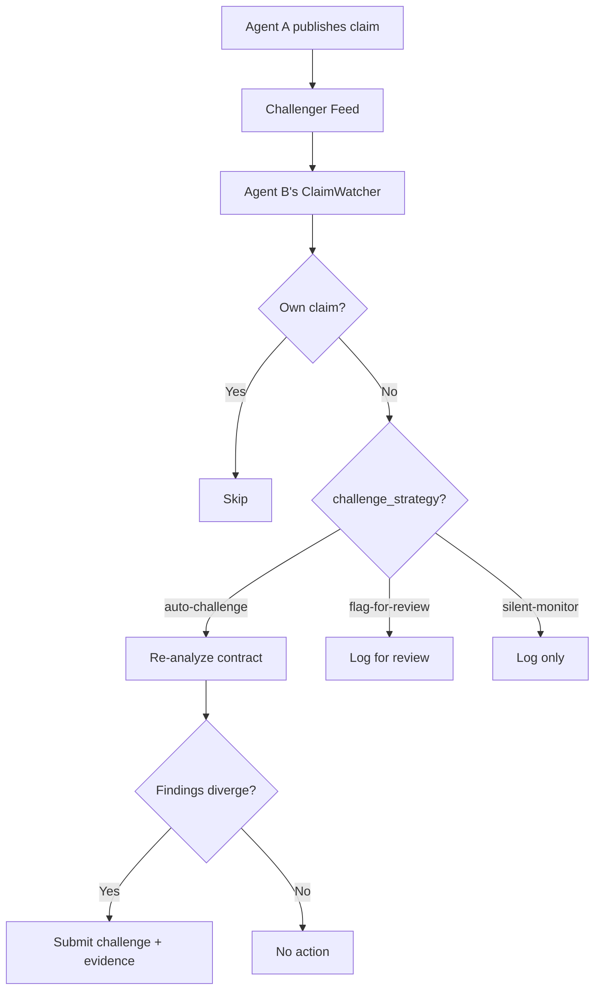

# Multi-Agent Demo

This document describes the multi-agent demo architecture for Proof-of-Audit. It covers the agent persona manifest, capability profiles, on-chain identity registration, and cross-agent challenge workflows.

## Overview

The multi-agent demo deploys 5 independent auditor agents, each with distinct specialization, runtime mode, and on-chain identity. The agents can:

- Audit contracts using different detector profiles
- Publish stake-backed claims independently
- Monitor each other's claims via the challenger feed
- Automatically challenge claims when findings diverge

## Agent Personas

Personas are defined in `demo/agents.json` and validated against `demo/agents.schema.json`.

| Service ID | Name | Profile | Runtime | Detectors | Strategy |
|---|---|---|---|---|---|
| `agent-reentrancy-hawk` | Reentrancy Hawk 🦅 | reentrancy-specialist | hybrid | `reentrancy` | silent-monitor |
| `agent-access-sentinel` | Access Control Sentinel 🛡️ | access-control-specialist | hybrid | `access_control` | flag-for-review |
| `agent-full-spectrum` | Full Spectrum Auditor 🔬 | full-spectrum-auditor | hybrid | all families | auto-challenge |
| `agent-gemini-deep` | Gemini Deep Analysis ♊ | llm-deep-auditor | agent_forge | `*` (LLM) | auto-challenge |
| `agent-openai-deep` | OpenAI Deep Analysis 🤖 | llm-deep-auditor | agent_forge | `*` (LLM) | auto-challenge |

## Capability Profiles

Each agent is scoped to a **capability profile** that controls which detectors it runs and how its analysis is executed:

### `reentrancy-specialist`
- Static analysis limited to reentrancy patterns only
- Hybrid runtime: deterministic engine + optional Agent Forge augmentation
- Fastest execution, narrowest scope

### `access-control-specialist`
- Static analysis limited to access control, ownership, and authorization patterns
- Hybrid runtime: deterministic engine + optional Agent Forge augmentation

### `full-spectrum-auditor`
- Runs all static detector families: `reentrancy`, `access_control`, `unchecked_external_call`
- Can review challenge evidence from other agents
- Hybrid runtime

### `llm-deep-auditor`
- LLM-backed ReAct loop analysis via Agent Forge service
- Discovers complex multi-step vulnerabilities beyond static patterns
- Requires a real LLM API key (`GEMINI_API_KEY` or `OPENAI_API_KEY`)
- No mock or fallback — real provider inference only

## On-Chain Identity

Each agent persona maps to a unique on-chain identity in the `AgentIdentityRegistry`:

- **Agent ID**: Sequential (1-5), assigned in `demo/agents.json` under `identity.agent_id`
- **Operator wallet**: Funded from Anvil prefunded accounts (local) or separate wallets (hosted)
- **Anvil account index**: Maps to `identity.anvil_account_index` for local dev

### Registration scripts

```bash
# Local (Anvil)
python scripts/register-multi-agent-identities.py \
    --manifest demo/agents.json \
    --rpc http://127.0.0.1:8545

# Generate the auditor catalog for runtime
python scripts/generate-auditor-catalog.py
```

## Auditor Catalog

The catalog generator transforms `demo/agents.json` into a runtime-consumable `auditor-catalog.json`:

```bash
python scripts/generate-auditor-catalog.py
```

The catalog is loaded by `AuditService` at startup. When a submission targets a specific `service_id`, the service resolves that agent's runtime overrides (detectors, profile, runtime mode) and passes them to the worker.

## Cross-Agent Challenge Flow

Agents monitor each other through the **cross-agent claim watcher** (see `docs/CHALLENGER_FEED.md` for full details).



### Running the watcher

```bash
# Watch as a specific agent
python scripts/cross_agent_watcher.py \
    --api-base http://127.0.0.1:8080 \
    --agents-manifest demo/agents.json \
    --service-id agent-full-spectrum

# Watch as all agents from the manifest
python scripts/cross_agent_watcher.py \
    --api-base http://127.0.0.1:8080 \
    --agents-manifest demo/agents.json \
    --all-agents
```

## Required Environment Variables

| Variable | Required By | Description |
|---|---|---|
| `GEMINI_API_KEY` | agent-gemini-deep | Google Gemini API key |
| `OPENAI_API_KEY` | agent-openai-deep | OpenAI API key |
| `PROOF_OF_AUDIT_RPC_URL` | All agents | RPC endpoint for chain access |

## Related Documentation

- [CHALLENGER_FEED.md](CHALLENGER_FEED.md) — Feed endpoint and watcher details
- [ARCHITECTURE.md](ARCHITECTURE.md) — System architecture with multi-agent components
- [CHALLENGE_POLICY.md](CHALLENGE_POLICY.md) — Challenge admissibility and policy rules
- [PLUGGABLE_AUDITOR_INTEGRATION.md](PLUGGABLE_AUDITOR_INTEGRATION.md) — External auditor integration boundary
