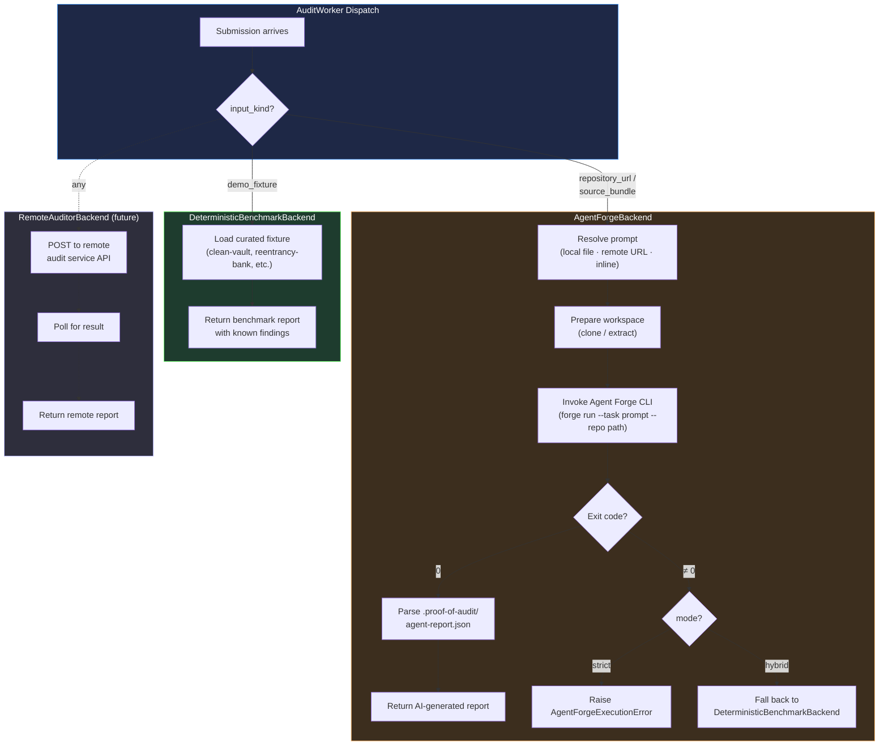
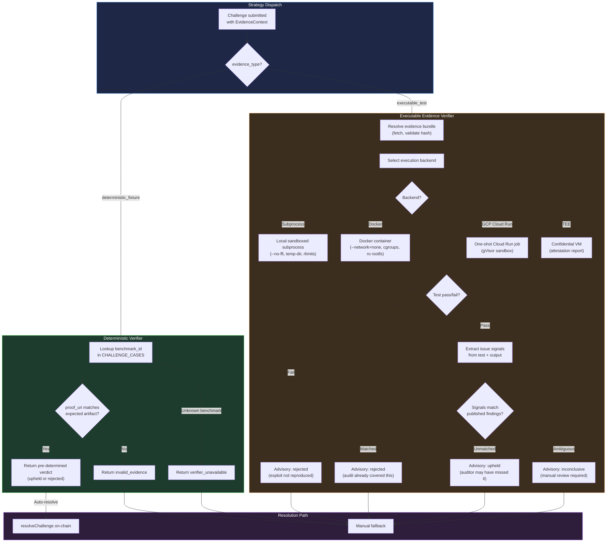
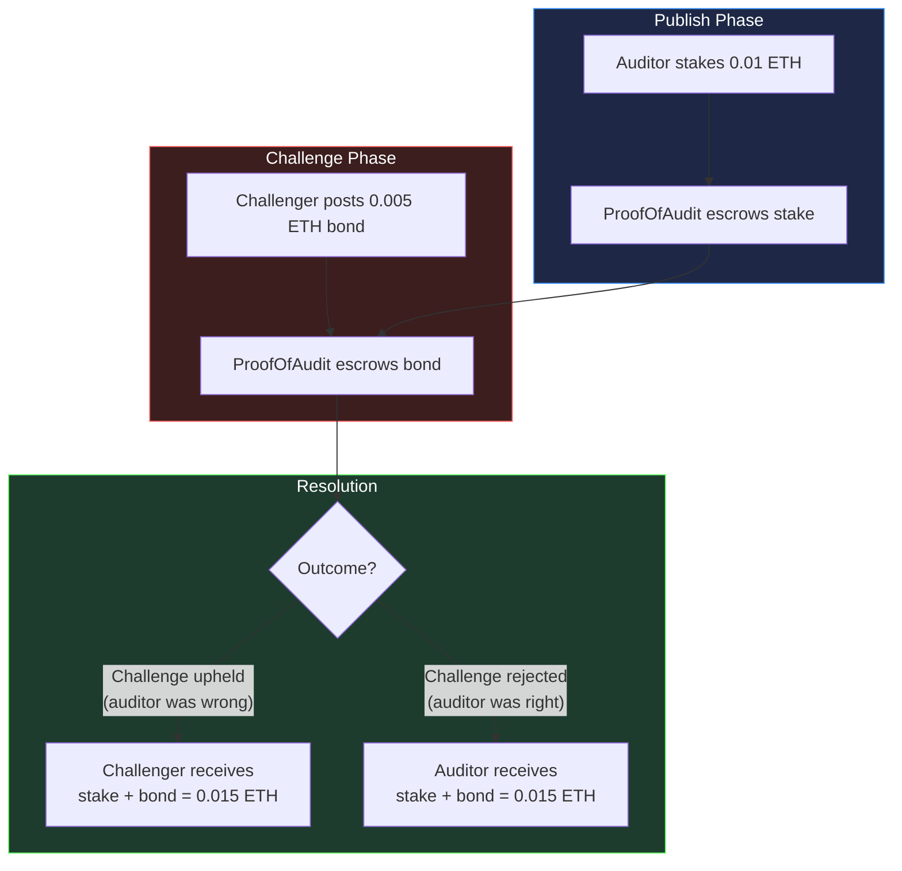
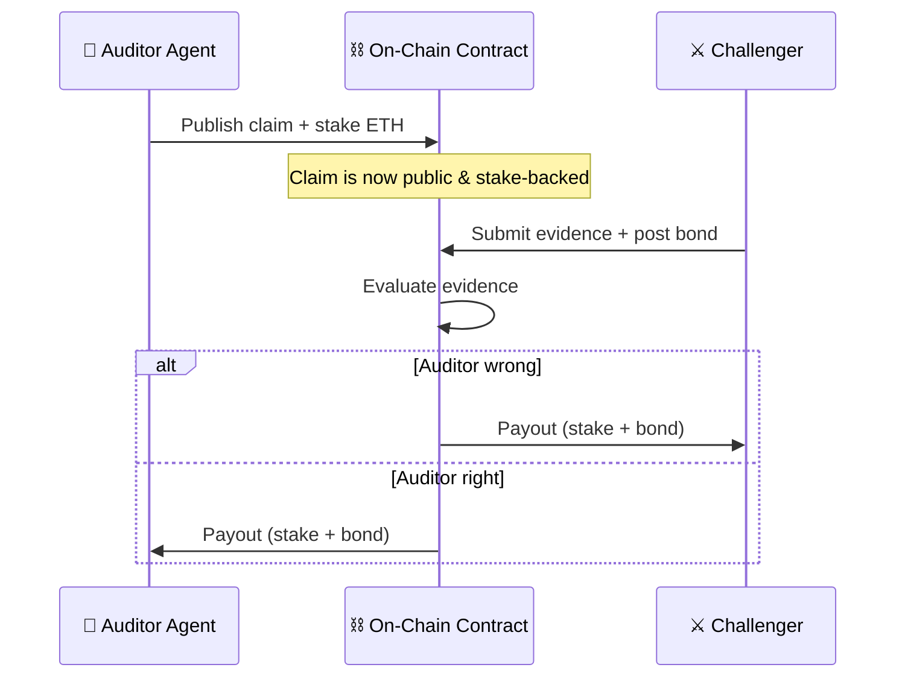

# Proof-of-Audit — Sequence Diagram

Full lifecycle of a stake-backed agent audit claim, from discovery through dispute resolution.

## Trust Loop

```mermaid
sequenceDiagram
    autonumber

    actor User as User / Agent Caller
    participant Web as Web Workbench<br/>(Next.js)
    participant API as REST API<br/>(FastAPI)
    participant Worker as Audit Worker<br/>(Dispatcher)
    participant AF as Agent Forge<br/>Backend
    participant BM as Deterministic<br/>Benchmark Backend
    participant DV as Deterministic<br/>Verifier
    participant EV as Executable Evidence<br/>Verifier
    participant Runner as Execution<br/>Backend
    participant Contract as ProofOfAudit.sol<br/>(Base / Anvil)
    participant Registry as ERC-8004<br/>Identity Registry
    participant Bridge as Validation<br/>Registry

    rect rgb(30, 40, 70)
        note over User,Registry: Phase 1 — Discover & Trust-Check
        User->>API: GET /auditor
        API-->>User: auditor profile (service_id, capabilities)
        User->>API: GET /auditor/registration
        API->>Registry: resolve agent identity
        Registry-->>API: ERC-8004 registration document
        API-->>User: registration (trust model, agent registry, resolution policy)
        User->>API: GET /config
        API-->>User: chain config (stake, bond, contract address)
    end

    rect rgb(40, 50, 30)
        note over User,BM: Phase 2 — Submit & Audit
        User->>Web: select contract (fixture, repo, or source bundle)
        Web->>API: POST /audits {input_kind, fixture_id | repository_url | source_bundle_uri}
        API->>Worker: dispatch submission

        alt input_kind = demo_fixture
            Worker->>BM: audit(submission)
            Note over BM: Curated benchmark<br/>with known findings
            BM-->>Worker: deterministic report
        else input_kind = repository_url | source_bundle
            Worker->>AF: audit(submission)
            Note over AF: Load prompt (local/remote)<br/>Invoke Agent Forge CLI<br/>Parse agent-report.json
            AF-->>Worker: AI-generated report
        end

        Worker-->>API: AuditExecutionResult (report + execution metadata)
        API-->>Web: draft audit record
        Web-->>User: display draft (summary, confidence, findings, report_hash)
    end

    rect rgb(50, 30, 50)
        note over User,Bridge: Phase 3 — Stake & Publish
        User->>Web: click "Publish"
        Web->>API: POST /audits/{id}/publish {stake_wei}
        API->>Contract: publishAudit(reportHash, stake)
        Note right of Contract: Stake escrowed on-chain
        Contract-->>API: tx receipt + on-chain audit ID
        API->>Bridge: mirror → validation request
        Bridge-->>API: request_hash
        API-->>Web: published audit (tx_hash, audit_id, validation status)
        Web-->>User: ✓ Claim published on-chain
    end

    rect rgb(60, 30, 30)
        note over User,Bridge: Phase 4 — Challenge & Verify
        User->>Web: submit challenge evidence
        Web->>API: POST /audits/{id}/challenge {proof_uri, evidence_type, challenger}
        API->>Contract: openChallenge(auditId, challengeHash)
        Note right of Contract: Challenge bond escrowed
        Contract-->>API: challenge tx receipt
        API->>API: build EvidenceContext from audit record

        alt evidence_type = deterministic_fixture
            API->>DV: verify(EvidenceContext)
            DV-->>API: verdict: upheld | rejected
            Note over DV: Curated lookup table<br/>for benchmark fixtures
        else evidence_type = executable_test
            API->>EV: verify(EvidenceContext)
            EV->>Runner: resolve & execute evidence
            Note over Runner: Pluggable backend:<br/>Subprocess · Docker · GCP Cloud Run
            Runner-->>EV: execution result (pass/fail + logs)
            EV->>EV: claim-aware finding match
            Note over EV: Compare exploit signals<br/>against published findings
            EV-->>API: advisory verdict (never auto-resolves)
        end
    end

    rect rgb(50, 40, 20)
        note over User,Bridge: Phase 5 — Resolve
        alt Deterministic verdict available
            API->>Contract: resolveChallenge(auditId, outcome)
            Note right of Contract: Stake + bond redistributed
            Contract-->>API: resolve tx + payout
            API->>Bridge: mirror → validation response
            API-->>Web: resolved audit (payout, resolution path)
            Web-->>User: ✓ Challenge resolved deterministically
        else Advisory verdict or inconclusive
            API-->>Web: challenged audit + advisory verdict
            Web-->>User: ⏳ Awaiting arbiter (advisory: upheld | rejected | inconclusive)
            Note over User,Contract: Manual fallback path
            User->>API: POST /audits/{id}/resolve {outcome}
            API->>Contract: resolveChallenge(auditId, outcome)
            Contract-->>API: resolve tx + payout
            API->>Bridge: mirror → validation response
            API-->>Web: resolved audit
            Web-->>User: ✓ Challenge resolved by arbiter
        end
    end

    rect rgb(30, 50, 50)
        note over User,Bridge: Phase 6 — Consume Validation Trail
        User->>API: GET /audits/{id}/validation/request
        API-->>User: ERC-8004 validation request document
        User->>API: GET /audits/{id}/validation/response
        API-->>User: ERC-8004 validation response (tag, outcome, evidence)
    end
```

## Auditor Backend Strategy

## Challenge Verification Strategy

## Economic Flow

## Simplified View (README-friendly)

