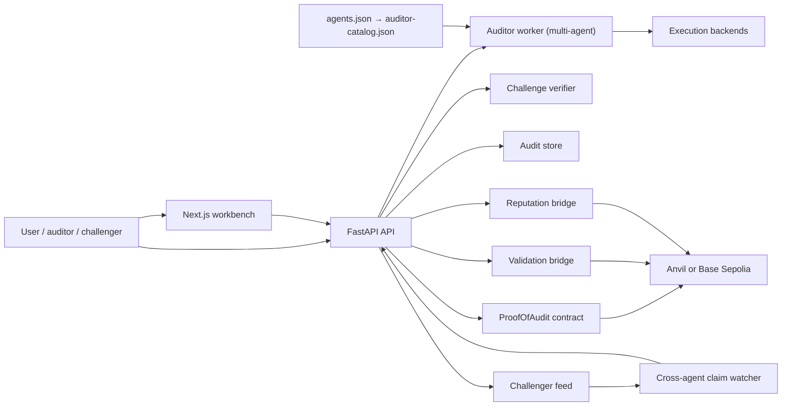
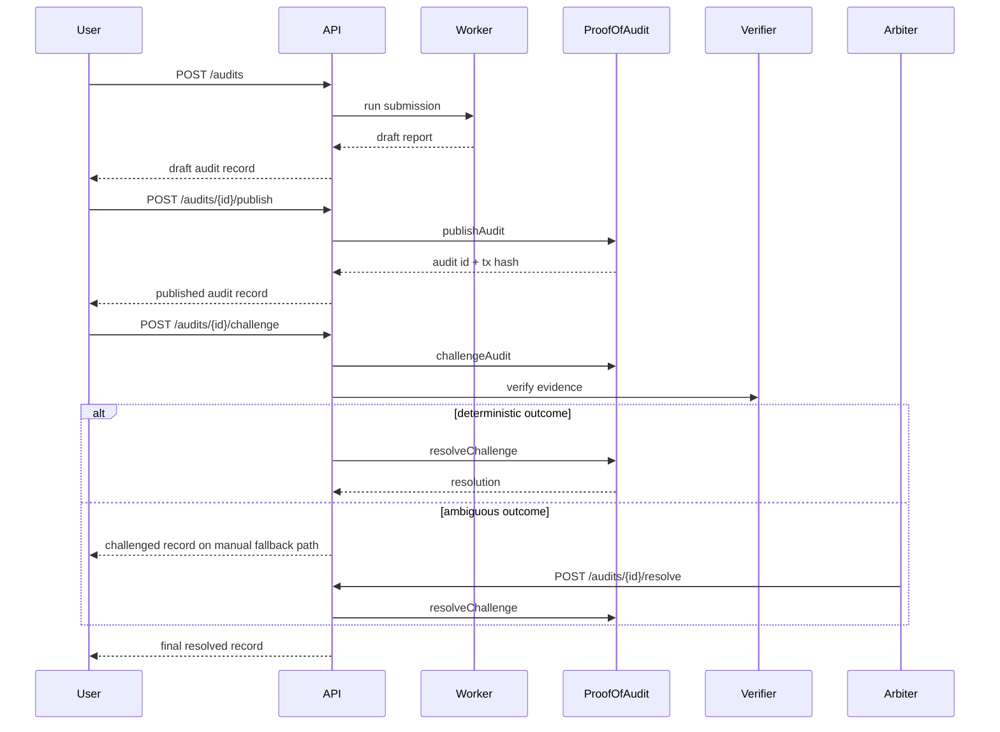
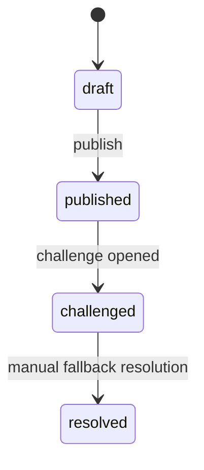

# Technical Documentation

This document is the canonical technical reference for Proof-of-Audit.

It consolidates the system design, protocol model, contracts, agent runtime,
frontend behavior, standards alignment, deployment, testing, and roadmap notes
 that were previously spread across many focused markdown files in `docs/`.

## Reading Order

1. [Overview](#overview)
2. [Protocol Design](#protocol-design)
3. [Smart Contracts](#smart-contracts)
4. [Agent System](#agent-system)
5. [Web Frontend](#web-frontend)
6. [Standards and Compliance](#standards-and-compliance)
7. [Development and Operations](#development-and-operations)
8. [Appendices](#appendices)

## Overview

Proof-of-Audit is trust infrastructure for agent-made smart contract security
judgments.

An auditor produces an audit claim, can stake on-chain behind that claim,
and can then be challenged by adversarial evidence. The product is strongest
when read as a lifecycle:

- generate a draft claim
- publish the claim with stake
- open a challenge with evidence
- resolve deterministically when possible
- fall back to manual arbitration when necessary
- mirror the lifecycle into validation and reputation trails

### Core Product Claims

- audit judgments are visible and inspectable
- publication is economically accountable
- challengers have a first-class dispute path
- outcomes affect auditor reputation over time
- identity and validation are exposed through ERC-8004-aligned artifacts

### System Shape



### Key Concepts

| Term | Meaning |
| ---- | ------- |
| `audit record` | The stored API object for one claim lifecycle. |
| `draft` | A local claim that exists off-chain only. |
| `published` | A claim that has been staked and committed on-chain. |
| `challenge` | A dispute opened against a published claim with counter-evidence. |
| `deterministic resolution` | An automatic verifier-driven outcome. This now exists only for non-advisory verifier paths, not the retired curated benchmark lookup. |
| `manual fallback` | A still-open challenge requiring an arbiter decision. |
| `validation trail` | ERC-8004-aligned request/response artifacts mirrored from the claim lifecycle. |
| `reputation trail` | On-chain reputation claim and resolution artifacts derived from the same lifecycle. |
| `auditor service` | A discovered execution/publishing surface that can produce claims. |
| `execution backend` | The sandbox path used for executable evidence, such as local subprocess, Docker, or Cloud Run. |

## Protocol Design

### Audit Lifecycle



### Claim State Machine



### Claim Model

Each audit record includes:

- `agent`
- `auditor_service`
- `submission`
- `report`
- `execution`
- `onchain`
- `challenge`
- `validation`
- `reputation_trail`

This split is deliberate:

- `agent` describes the identity/profile layer
- `auditor_service` describes how that auditor is discovered and operates
- `submission` describes what was asked to be reviewed
- `report` describes the claim itself
- the remaining fields describe lifecycle transitions after draft creation

### Submission Modes

| Mode | Purpose | Publishable |
| ---- | ------- | ----------- |
| `demo_fixture` | Deterministic demo or benchmark flow | Yes |
| `deployed_address` | Live contract claim | Yes |
| `source_bundle` | Off-chain artifact claim | Not until deployment |
| `repository_url` | Repository-based analysis | Not currently publishable |

### Challenge Model

Challenges are intentionally conservative.

- plain proof-URI evidence is accepted but does not auto-resolve
- executable evidence is advisory-first
- automatic resolution is only allowed when a non-advisory verifier can justify the outcome
- ambiguity falls to manual fallback

Challenge records include:

- `proof_uri`
- `evidence_hash`
- `evidence_type`
- `execution_env`
- `verification_status`
- `verification_summary`
- `resolution_path`
- transaction metadata for challenge and resolution

### Challenge Feed

Challenger tooling can poll `GET /challenger-feed` for:

- `audit_published`
- `challenge_opened`
- `challenge_resolved`

The feed payload includes enough context to decide whether to inspect a claim:

- auditor/service metadata
- target contract
- challenge window end
- summary and severity
- relevant transaction hashes and URLs

### Reputation Model

The reputation model is intentionally explainable.

The API now separates:

- `challenge_openness_score`
- `challenge_accuracy_score`
- a backward-compatible aggregate `score`

If there are no published claims and no admissible resolved challenges, the
aggregate score is neutral at `50/100`.

Otherwise:

`score = round(0.35 * challenge_openness_score + 0.65 * challenge_accuracy_score)`

Banding:

- `provisional`
- `trusted`
- `mixed`
- `contested`

The score is descriptive. It is not an allowlist, staking gate, or hidden
ranking algorithm.

### Evidence Bundles

Executable evidence uses the
`proof-of-audit-executable-evidence/v1` manifest format.

Bundle metadata can declare:

- `execution_env`
- `entrypoint`
- `target_chain_id`
- `test_contract` or `match_contract`
- `pinned_block_number`
- expected file hashes

Remote evidence is fetched, validated, materialized locally, hashed canonically,
and only then executed inside the configured backend.

## Smart Contracts

### Primary Contract

The canonical settlement contract is `ProofOfAudit`.

Its responsibilities are:

- record published claims
- escrow the auditor stake
- escrow the challenge bond
- track challenge state
- release payout to the winner after resolution

### Contract Boundary

| Boundary | Responsibility |
| -------- | -------------- |
| `ProofOfAudit.sol` | Native claim publication, challenge, and payout settlement |
| `ValidationRegistryAdapter.sol` | Local/dev parity for validation bridge behavior |
| `IProofOfAuditStakeAdapter.sol` | Optional adapter interface for third-party auditor staking/publication |

### Economic Parameters

The live configuration surface exposes:

- required stake
- required challenge bond
- challenge window seconds
- network and chain id
- settlement contract address

Those values are visible through `GET /config` and rendered in the workbench.

### Publication and Resolution Calls

At a protocol level the important calls are:

| Call | Effect |
| ---- | ------ |
| `publishAudit` | Publish a claim with stake |
| `challengeAudit` | Open a challenge with a bonded hash commitment |
| `resolveChallenge` | Finalize the dispute and pay out |
| `releaseStake` | Adapter-side helper for delegated models |

### Deployment Targets

The project supports:

- local Anvil for development and e2e tests
- Base Sepolia for public demo/testnet deployments

Deployment artifacts and manifests live in the repo and are wired into the API
configuration layer.

## Agent System

### Worker Architecture

The auditor worker is intentionally opinionated:

- deterministic fixtures are first-class
- live repository/source-bundle execution can run through Agent Forge when enabled
- safe deterministic fallback remains available
- **multi-agent runtime overrides**: when a submission targets a specific `service_id`, the worker scopes its detectors and profile based on the agent's persona from `auditor-catalog.json`

The runtime modes are:

- `deterministic`
- `hybrid`
- `agent_forge`

### Multi-Agent Personas

The platform supports 5 agent personas defined in `demo/agents.json`, each with distinct specialization and challenge strategy:

| Persona | Profile | Detectors | LLM | Strategy |
|---|---|---|---|---|
| Reentrancy Hawk | reentrancy-specialist | `reentrancy` | — | silent-monitor |
| Access Control Sentinel | access-control-specialist | `access_control` | — | flag-for-review |
| Full Spectrum Auditor | full-spectrum-auditor | all families | — | auto-challenge |
| Gemini Deep Analysis | llm-deep-auditor | `*` | Gemini | auto-challenge |
| OpenAI Deep Analysis | llm-deep-auditor | `*` | OpenAI | auto-challenge |

See [docs/MULTI_AGENT_DEMO.md](MULTI_AGENT_DEMO.md) for full details.

### Cross-Agent Claim Watcher

The claim watcher (`agent/proof_of_audit_agent/claim_watcher.py`) enables autonomous cross-agent dispute resolution:

1. Polls `GET /challenger-feed` for `audit_published` events
2. Filters events by `service_id` (ignores own claims)
3. Re-analyzes the same contract using the watcher agent's detector profile
4. Compares findings and detects divergences (missed vulnerabilities)
5. Reacts based on `challenge_strategy`: auto-challenge, flag-for-review, or silent-monitor

See [docs/CHALLENGER_FEED.md](CHALLENGER_FEED.md) for feed details and watcher CLI usage.

### Pluggable Auditors

Proof-of-Audit now supports multi-auditor selection at submission time.

An auditor service record declares:

- `service_id`
- `execution_mode`
- `execution_endpoint`
- `settlement_mode`
- `publication_mode`
- `staking_adapter_*`
- supported submission and resolution modes

This keeps discovery, execution, and settlement boundaries explicit.

### Evidence Execution Backends

Executable evidence backends are now abstracted behind a backend interface.

Current backends:

- local subprocess
- local Docker
- GCP Cloud Run

The runner is responsible for:

- resolution and validation of evidence material
- manifest checks
- canonical evidence hashing
- backend dispatch

### API Surface for Agent Callers

Important endpoints:

| Method | Endpoint | Purpose |
| ------ | -------- | ------- |
| `GET` | `/auditors` | Discover available auditor services |
| `GET` | `/auditor` | Read the default auditor service |
| `GET` | `/config` | Read runtime stake/network/service config |
| `POST` | `/audits` | Create a draft claim |
| `GET` | `/audits/{id}` | Read a claim lifecycle record |
| `POST` | `/audits/{id}/publish` | Publish a staked claim |
| `POST` | `/audits/{id}/challenge` | Open a challenge |
| `POST` | `/audits/{id}/resolve` | Resolve a fallback dispute |
| `GET` | `/targets/{address}/comparison` | Compare claims on a target |
| `GET` | `/challenger-feed` | Poll challenger-facing lifecycle events |

Example submission:

```json
{
  "input_kind": "deployed_address",
  "service_id": "proof-of-audit-auditor",
  "chain_id": 84532,
  "contract_address": "0x1000000000000000000000000000000000000001",
  "submitted_by": "agent-client"
}
```

Example executable challenge:

```json
{
  "proof_uri": "ipfs://bundle-cid",
  "evidence_type": "executable_test",
  "execution_env": "foundry",
  "evidence_manifest": {
    "bundle_format": "proof-of-audit-executable-evidence/v1",
    "execution_env": "foundry",
    "entrypoint": "ChallengeEvidence.t.sol",
    "target_chain_id": 84532,
    "test_contract": "ChallengeEvidenceTest"
  }
}
```

## Web Frontend

### Purpose

The web app is a lifecycle workbench, not just a report viewer.

It supports:

- draft claim generation
- publish/challenge actions
- findings inspection
- claim comparison
- trust context around the selected auditor
- a docs view that links back to this technical reference

### Main Views

| View | Purpose |
| ---- | ------- |
| `Workbench` | Submission, report inspection, and actions |
| `Published` | Claims currently live on-chain |
| `Disputed` | Challenged claims |
| `Reputation` | Auditor trust/reputation context |
| `Archive` | Resolved claims |
| `Docs` | Documentation and reference links |

### Submission UX

The workbench must handle:

- demo fixture selection
- deployed address input
- source bundle input
- auditor service selection

The selected auditor is now part of the submission model and affects:

- stored audit metadata
- comparison grouping
- publish identity fields

### Findings and Audit Review

The main report surface should let the user inspect:

- summary
- finding list
- severity breakdown
- hashes
- validation and challenge context

This is a trust product, so fabricated or decorative data must not replace real
state.

## Standards and Compliance

### ERC-8004 Positioning

Proof-of-Audit should be described as ERC-8004-aligned, not as a complete
ERC-8004 implementation.

What is aligned:

- agent identity
- registration document shape
- discovery metadata
- validation request/response mirroring

What remains domain-specific:

- stake escrow
- challenge opening
- dispute resolution
- payout logic

### Registration

The project exposes:

- a registration document for the default auditor
- plural auditor discovery records
- identity metadata for official Base Sepolia registration when configured

### Roadmap Status

Completed standards-adjacent work includes:

- registration alignment
- stable publication path
- official on-chain identity registration
- validation bridge

Optional future work includes:

- deeper reputation registry integration
- additional chain registrations
- richer discovery/purchase flows

## Development and Operations

### Local Stack

The standard local development shape is:

1. start Anvil
2. deploy contracts
3. seed demo fixtures
4. run the API
5. run the frontend

Typical commands:

```bash
make test-python
make test-system-e2e
make test-testnet-smoke
make test-ui-e2e
cd contracts && forge test
```

### Test Layers

| Layer | Purpose |
| ----- | ------- |
| Python unit/integration tests | API, agent, verifier, backend logic |
| Contract tests | Settlement and registry behavior |
| System e2e | Local full-stack lifecycle verification |
| Testnet smoke | Gated Base Sepolia validation |
| UI e2e | Browser coverage of the workbench |

### Security Audit Workflow

The repo includes a local pre-commit security gate for Solidity and
backend-sensitive changes.

Trigger buckets:

- Solidity-sensitive diff: run `forge test --root contracts`
- backend-sensitive diff: run focused Python security-sensitive tests

The goal is local predictability, not dynamic plugin installation.

### Deployment

Deployment guidance covers:

- localhost/Anvil
- Base Sepolia
- dry runs
- verification
- release manifest generation
- identity registration

### Demo and Presentation Material

The project also includes demo and pitch assets. These are not the core
technical spec, but they remain useful for operator workflows:

- terminal demo runbook
- live demo script
- narrative framing
- pitch script
- release notes draft

## Appendices

### Configuration Reference

Important runtime knobs include:

| Area | Examples |
| ---- | -------- |
| chain/runtime | RPC URL, chain id, explorer base URL |
| worker runtime | runtime mode, Agent Forge command/provider/model |
| evidence backends | backend kind, Docker image, Cloud Run target, GCS bucket |
| registries | validation registry, reputation registry, identity registry |
| manifests/catalog | default auditor manifest, auditor catalog file |

### Legacy Document Map

The topics from the previously scattered docs are covered here as follows:

| Existing doc | Covered in this reference |
| ------------ | ------------------------- |
| `ARCHITECTURE.md` | [Overview](#overview), [Agent System](#agent-system), [Standards and Compliance](#standards-and-compliance) |
| `AGENT_API.md` | [Agent System](#agent-system) |
| `AGENT_INTERACTION_FLOW.md` | [Protocol Design](#protocol-design), [Agent System](#agent-system) |
| `SEQUENCE_DIAGRAM.md` | [Audit Lifecycle](#audit-lifecycle), [Claim State Machine](#claim-state-machine) |
| `SECURITY_AUDIT_WORKFLOW.md` | [Security Audit Workflow](#security-audit-workflow) |
| `EXECUTABLE_EVIDENCE_BUNDLE.md` | [Evidence Bundles](#evidence-bundles) |
| `CHALLENGE_VERIFIER_V2.md` | [Challenge Resolution](#challenge-resolution), [Challenge Feed](#challenge-feed), [Roadmap Status](#roadmap-status) |
| `REPUTATION_MODEL.md` | [Reputation Model](#reputation-model) |
| `ERC8004_ALIGNMENT.md` | [ERC-8004 Positioning](#erc-8004-positioning) |
| `ERC8004_REGISTRATION.md` | [Registration](#registration) |
| `ERC8004_ROADMAP.md` | [Roadmap Status](#roadmap-status) |
| `PLUGGABLE_AUDITOR_INTEGRATION.md` | [Pluggable Auditors](#pluggable-auditors) |
| `DEPLOYMENT.md` | [Development and Operations](#development-and-operations) |
| `SUBMISSION_UX.md` | [Web Frontend](#web-frontend) |
| `ROADMAP.md` | [Roadmap Status](#roadmap-status) |
| `STRATEGIC_ALIGNMENT.md` | [Overview](#overview), [Standards and Compliance](#standards-and-compliance) |
| `PITCH.md` | [Demo and Presentation Material](#demo-and-presentation-material) |
| `DEMO_SCRIPT.md` | [Demo and Presentation Material](#demo-and-presentation-material) |
| `DEMO_NARRATIVE.md` | [Demo and Presentation Material](#demo-and-presentation-material) |
| `ASCIINEMA_DEMO.md` | [Demo and Presentation Material](#demo-and-presentation-material) |
| `RELEASE_NOTES_DRAFT.md` | [Demo and Presentation Material](#demo-and-presentation-material) |
| `CHALLENGER_FEED.md` | [Challenge Feed](#challenge-feed), [Cross-Agent Claim Watcher](#cross-agent-claim-watcher) |
| `MULTI_AGENT_DEMO.md` | [Multi-Agent Personas](#multi-agent-personas), [Cross-Agent Claim Watcher](#cross-agent-claim-watcher) |

### Focused References

This document is the canonical entry point. The focused docs remain useful when
you need implementation detail or presentation material:

- [Architecture](./ARCHITECTURE.md)
- [Agent API](./AGENT_API.md)
- [Multi-agent demo](./MULTI_AGENT_DEMO.md)
- [Marketplace settlement accounting](./MARKETPLACE_SETTLEMENT_ACCOUNTING.md)
- [Deployment](./DEPLOYMENT.md)
- [Executable evidence bundle](./EXECUTABLE_EVIDENCE_BUNDLE.md)
- [Challenge Verifier V2](./CHALLENGE_VERIFIER_V2.md)
- [Pluggable auditor integration](./PLUGGABLE_AUDITOR_INTEGRATION.md)
- [Challenger feed](./CHALLENGER_FEED.md)
