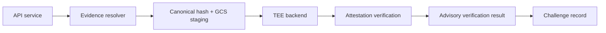

# RFC: TEE-Backed Evidence Execution

## Status

Research note only. No implementation is recommended at this stage.

## Question

Should Proof-of-Audit add a TEE-backed executable-evidence path for stronger
neutrality guarantees?

## Short Answer

Not yet.

The current executable-evidence path is still operator-controlled, so the
neutrality concern is real. But a TEE backend does not solve the most important
remaining trust boundary by itself: the challenger and verifier still need a
trustworthy view of forked chain state and RPC provenance.

If the project revisits this later, the most credible first target is a
confidential-VM backend on GCP, using an AMD SEV-SNP or Intel TDX Confidential
VM, kept advisory-only at first.

## Recommendation

### Go / No-Go

- `No-go` for immediate product implementation
- `Go` only for a narrow PoC later, after the current challenger/evidence path
  needs stronger neutrality than the existing Docker and Cloud Run isolation

### Recommended TEE Target

If pursued, prefer:

1. `Confidential VM` on GCP
2. `AMD SEV-SNP` first when operational simplicity matters most
3. `Intel TDX` second when richer integrity-policy appraisal is the main goal

Do not start with:

- `Intel SGX`
- `AWS Nitro Enclaves`

## Why This Recommendation

### Best Fit for Foundry

Foundry-based execution wants a normal Linux userland, a packaged toolchain,
temporary filesystem state, and controlled access to an RPC source.

That is a better fit for a confidential VM than for a narrow enclave runtime.

### Cloud Alignment

The repository already has a GCP Cloud Run backend and GCS staging path, so a
future GCP confidential-computing execution path would fit the current operator
footprint better than a new AWS-specific enclave stack.

### Attestation Maturity

Official Google Cloud documentation shows attestation support for Confidential
VMs using both AMD SEV-SNP and Intel TDX, and documents retrieval/verification
paths for attestation reports and launch endorsements. Intel Trust Authority
also documents TDX integrity appraisal for GCP-based TDX trust domains.

## Option Comparison

| Option | Fit for Foundry runner | Main advantages | Main problems | Recommendation |
| ------ | ---------------------- | --------------- | ------------- | -------------- |
| Intel SGX | Poor | Strong enclave story for small trusted components | Too invasive for an unmodified toolchain and broader Linux execution model | No |
| AWS Nitro Enclaves | Medium-low | Clear attestation model, strong image identity, hard isolation | No external networking, no persistent storage, parent-instance proxy model via vsock adds integration friction; AWS-only path diverges from current GCP direction | No for first implementation |
| GCP Confidential VM with AMD SEV-SNP | High | Full-VM fit, attestation support, easier migration from current remote backend shape | Still requires custom attestation verification and policy design; does not solve RPC trust by itself | Best first candidate |
| GCP Confidential VM with Intel TDX | High | Full-VM fit, attestation support, stronger documented integrity/appraisal path | More policy and measurement management overhead than a simple “run a VM” posture | Strong second candidate |

## What a TEE Path Would Prove

A correctly designed TEE backend could improve confidence in:

- the execution environment identity
- the boot/firmware/platform state reflected in the attestation evidence
- the runner image or package identity
- the exact evidence bundle hash supplied to the runner
- the exact output hash emitted by the runner
- freshness, if the attestation flow includes a nonce challenge

For Proof-of-Audit specifically, this means a relying party could have more
confidence that:

- the expected runner binary actually ran
- the expected evidence bundle was the one executed
- the resulting execution log and verdict hash came from that trusted runtime

## What It Would Not Prove

A TEE backend does not remove these trust boundaries:

- `RPC provenance`
  - if the runner forks from an RPC endpoint controlled by the operator, the
    enclave/VM can still execute against a biased or stale view of the chain
- `snapshot correctness`
  - even with a trusted runner, the selected block number and fetched state may
    still be the wrong ones
- `policy correctness`
  - the attestation verifier policy can be too weak or misconfigured
- `application correctness`
  - a trusted runner can still contain a logic bug
- `availability neutrality`
  - the operator can still deny service, starve resources, or refuse to launch

This is the core reason for the no-go recommendation today: the biggest
remaining neutrality gap for executable evidence is not just “who ran the code,”
it is also “what chain state was that code allowed to see.”

## Integration Shape

If implementation is ever pursued, it should integrate with the current
execution-backend abstraction rather than fork a separate verifier stack.

The prerequisite backend abstraction from `#117` is already complete, so this
work would be evaluated as “add one more backend” rather than “redesign the
runner first.”

### Proposed Shape

### Concrete Backend Shape

- add `tee_confidential_vm` as a new execution backend
- keep evidence fetch/validation/canonical hashing outside the TEE launch step
- stage the bundle by immutable object reference plus expected hash
- pass a nonce into the VM launch
- have the runner return:
  - attestation evidence
  - runner image identity
  - evidence hash
  - output hash
  - execution summary/log metadata
- verify the attestation before accepting the advisory result

## Challenge Record Additions

If a TEE path is added later, the challenge record should store at least:

- `tee_provider`
- `tee_technology`
- `attestation_format`
- `attestation_evidence`
- `attestation_verifier`
- `attestation_policy_id`
- `attestation_nonce`
- `runner_image_digest`
- `committed_evidence_hash`
- `executed_evidence_hash`
- `execution_output_hash`
- `target_chain_id`
- `fork_block_number`
- `rpc_source_class`

That is enough to let an external reviewer ask:

- was the right runtime launched?
- did it execute the right evidence?
- was the output bound to that runtime?
- what chain snapshot was it supposed to use?

## Advisory vs Protocol-Attested

If a TEE path exists at all, it should remain `advisory-only` first.

Reasons:

- the current protocol does not commit attestation artifacts on-chain
- on-chain attestation commitment would add significant complexity
- RPC provenance is still unresolved
- policy mistakes would be expensive to encode into a “trusted” automatic path

Only after an advisory path is stable should the project even consider whether
on-chain attestation commitment is worth the added protocol complexity.

## Minimum PoC Scope

If a PoC is ever funded, keep it deliberately small:

1. launch one Confidential VM type
2. run only Foundry-based executable evidence
3. use immutable staged bundles
4. capture attestation plus output hash
5. keep the result advisory-only
6. do not change on-chain challenge semantics yet

## Final Recommendation

Proof-of-Audit should not build a TEE backend now.

The right sequence is:

1. keep using the current backend abstraction and hardened non-TEE isolation
2. improve RPC and chain-state provenance first if stronger neutrality becomes a
   real product requirement
3. only then prototype a `tee_confidential_vm` backend
4. keep it advisory-only until the trust model is demonstrably better end to end

## Sources

- [Google Cloud Attestation](https://cloud.google.com/confidential-computing/docs/attestation)
- [Confidential VM attestation](https://docs.cloud.google.com/confidential-computing/confidential-vm/docs/attestation)
- [Verify a Confidential VM instance's firmware](https://docs.cloud.google.com/confidential-computing/confidential-vm/docs/verify-firmware)
- [AWS Nitro Enclaves overview](https://docs.aws.amazon.com/enclaves/latest/user/nitro-enclave.html)
- [AWS Nitro Enclaves security](https://docs.aws.amazon.com/enclaves/latest/user/security.html)
- [AWS Nitro Enclaves attestation](https://docs.aws.amazon.com/enclaves/latest/user/set-up-attestation.html)
- [Intel Trust Authority: Trust Domain Integrity](https://docs.trustauthority.intel.com/main/articles/articles/ita/concept-td-integrity.html)
