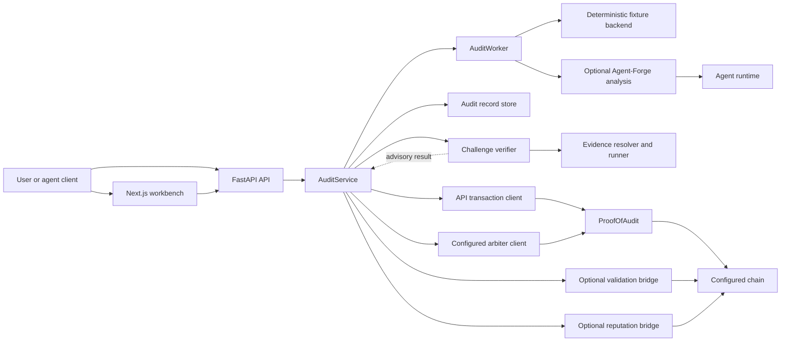

# Architecture overview

This is the canonical current system view for Proof-of-Audit. The service records audit claims, can submit stake-backed claims and challenges to `ProofOfAudit`, and exposes evidence for review. The auditor worker prepares reports; API transaction clients publish and resolve them. Verifier output is advisory, and the configured on-chain arbiter retains dispute authority.

## System context

The web workbench and direct API clients submit audit requests to the FastAPI service. The API coordinates analysis, local audit records, evidence verification, and configured chain integrations. A separate Agent-Forge runtime can provide source-based analysis, while the `ProofOfAudit` contract controls native stake, challenge, and payout state.

This is a logical dependency view, not a deployment topology or readiness claim. Current authorization, recovery, concurrency, and reconciliation limits are tracked in the [project state inventory](../strategy/STATE_OF_THE_PROJECT.md).

The worker and evidence runner produce analysis results. They do not submit native settlement transactions. The API transaction clients are the boundary between off-chain orchestration and the settlement contract.

## Components and ownership

| Component | Responsibility | Source |
| --- | --- | --- |
| FastAPI application | HTTP routes, security guards, runtime configuration, and service wiring | [API application](../../api/proof_of_audit_api/app.py) |
| Runtime configuration | Reads environment and deployment-manifest values for the chain, worker, stores, and optional bridges | [ContractConfig](../../api/proof_of_audit_api/config.py) |
| Audit service | Validates submissions, invokes the worker, stores records, and coordinates publishing and disputes | [AuditService](../../api/proof_of_audit_api/service.py) |
| Auditor worker | Produces deterministic fixture reports or invokes the configured Agent-Forge analysis lane | [AuditWorker](../../agent/proof_of_audit_agent/worker.py) |
| Agent-Forge backend | Runs a local command or calls the configured external service and normalizes its report | [Agent-Forge backend](../../agent/proof_of_audit_agent/agent_forge_backend.py) |
| Audit store | Persists audit records as JSON, SQLite, or Cloud SQL PostgreSQL | [Store implementations](../../api/proof_of_audit_api/store.py) |
| Native transaction client | Signs API-mediated publish and challenge transactions using configured credentials | [Publisher](../../api/proof_of_audit_api/publisher.py) |
| Settlement contract | Records claims and challenge state and enforces escrow and arbiter-only resolution | [ProofOfAudit](../../contracts/src/ProofOfAudit.sol) |
| Evidence verification | Checks challenge evidence and can run executable bundles in a bounded backend | [Challenge verifier](../../agent/proof_of_audit_agent/challenge_verifier.py) |
| Optional mirrors | Submit validation and reputation artifacts when their bridges are configured | [Validation bridge](../../api/proof_of_audit_api/validation_bridge.py), [reputation bridge](../../api/proof_of_audit_api/reputation_bridge.py) |

The API routes and response models are the source for FastAPI's generated OpenAPI document. See the [route definitions](../../api/proof_of_audit_api/app.py) and [API schemas](../../api/proof_of_audit_api/schemas.py). The external Agent-Forge contract has a separate [OpenAPI reference](../AGENT_FORGE_SERVICE_OPENAPI.yaml).

## Key flows

### Create and publish a claim

1. A client submits a fixture, deployed address, source bundle, or repository input to the API.
2. `AuditService` validates the input and calls `AuditWorker`. A `demo_fixture` uses the deterministic fixture backend. Source-aware inputs can use Agent-Forge when worker mode and service configuration allow it; hybrid execution may fall back according to the configured policy. The saved `execution` field records which path ran.
3. The API stores a draft audit record. Audit records use the configured JSON, SQLite, or Cloud SQL PostgreSQL `AuditStore`; SQLite is the application default.
4. A publish request causes the API's publisher to sign and submit `publishAudit` or the request-bound claim call. The worker does not sign or publish to the chain.
5. `ProofOfAudit` records claim hashes and escrow state. The API stores transaction metadata and may submit validation or reputation mirrors when those bridges are configured.

The `AuditRequest` index is a separate local JSON file at `audit-requests.json` under the configured data root. It is not part of the selected audit-record store. See the [request protocol](../AUDIT_REQUEST_PROTOCOL.md) and [participation guide](../AGENT_REQUEST_PARTICIPATION.md).

### Challenge and resolution

1. The API commits the challenge evidence hash and submits the challenge transaction with the configured bond.
2. A plain proof URI is recorded for manual review; it is not matched against a curated benchmark lookup. Executable evidence is validated and can be replayed in a bounded runner, producing a verifier dossier and an advisory verdict.
3. The API keeps an advisory result separate from settlement. Its automatic resolution branch requires a verified, non-advisory result and an available arbiter transaction client; the currently registered verifier paths do not supply an authoritative verdict.
4. For current flows, an operator-controlled arbiter client submits the resolution transaction. `ProofOfAudit` enforces that only the configured arbiter address can resolve a challenge.
5. Once resolved, the API may mirror the outcome to configured validation and reputation registries.

The native settlement contract is authoritative for stake, challenge, and payout. ERC-8004-aligned validation and reputation records are optional mirrors; they do not replace native settlement. See [challenge evidence format](../EXECUTABLE_EVIDENCE_BUNDLE.md), [challenge policy](../CHALLENGE_POLICY.md), and [ERC-8004 alignment](../ERC8004_ALIGNMENT.md).

## Data and trust boundaries

- Audit reports, execution metadata, and local lifecycle records are off-chain data. Native settlement records hashes, participants, challenge state, and escrow outcomes on-chain.
- `AuditWorker` has no chain-signing responsibility. The API publisher signs publish and challenge transactions; the configured arbiter client signs resolution transactions.
- Agent framework adoption is restricted to analysis and interoperability; frameworks are excluded from the trust and settlement layer. Model-assisted analysis remains advisory and cannot authorize a payout or replace contract checks. See the [technology radar](../strategy/AGENTIC_STACK.md) for the adoption boundary.
- Analysis may use deterministic fixture output or the optional Agent-Forge lane. A report is a claim to be published and challenged; running an analysis engine does not itself establish correctness.
- The challenge verifier evaluates evidence, but its current executable verdicts are advisory. The arbiter remains the decision authority for settlement, and the contract enforces that boundary.
- Validation and reputation bridges are configuration-dependent. A deployment without the required registry addresses and credentials may omit those mirrors.

## Deployment and limitations

This page describes repository source, not the state of a particular deployment. Contract version, registry addresses, API security settings, transaction keys, storage backend, worker mode, and Agent-Forge endpoint are deployment configuration. Source support for a request or settlement feature does not prove that it is available on Base Sepolia or another public deployment. Check the [recorded project state and readiness gaps](../strategy/STATE_OF_THE_PROJECT.md), [deployment guide](../DEPLOYMENT.md), and [request protocol deployment note](../AUDIT_REQUEST_PROTOCOL.md) before making deployment claims. In particular, the current inventory records that the generic mutating API guard does not provide customer/operator role separation and that durable job recovery and transaction reconciliation remain unimplemented.

The default worker mode is deterministic; a fixture audit returns a prewritten report rather than live analysis. Live Agent-Forge execution depends on configuration and input type. The legacy multi-agent persona demo is a parked fixture showcase, not a current product commitment. For current scope and phase ordering, use the [strategy roadmap](../strategy/ROADMAP.md).

## Related documentation

- [Cross-domain technical reference](../TECHNICAL_DOCUMENTATION.md)
- [Agent API](../AGENT_API.md)
- [Agent-Forge service contract](../AGENT_FORGE_SERVICE_CONTRACT.md) and [integration guide](../AGENT_FORGE_SERVICE_INTEGRATION.md)
- [Deployment](../DEPLOYMENT.md) and [Agent-Forge operations](../AGENT_FORGE_OPERATIONS.md)
- [Documentation map](../README.md)
